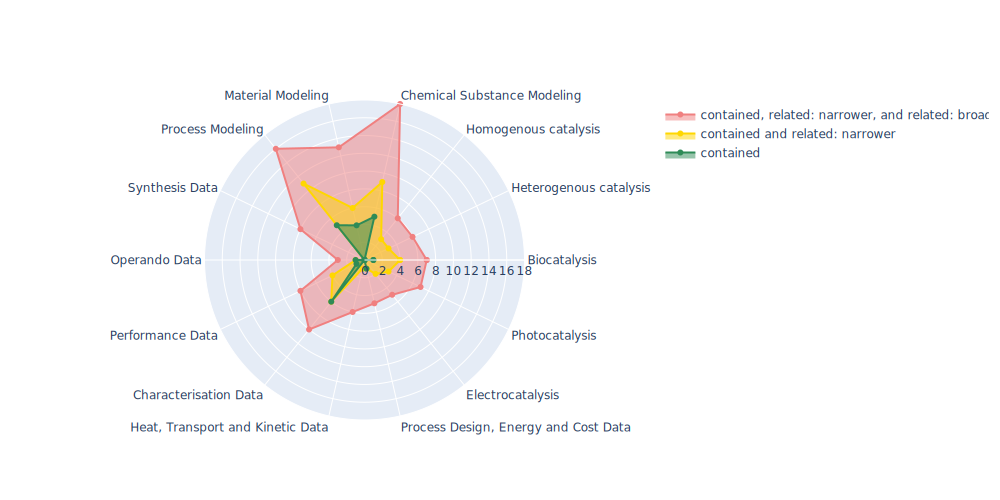

# Ontology World Map of NFDI4Cat

Repository which lists ontologies relevant for catalysis research.

For remarks, additions, or general questions either use the issues or contact the responsible person (see below).
A condensed view on the data provided in the markdown-files is given in [master_table](./master_table/MT_OntoWorldMap_2023-10-11.xlsx).
For contributions please either refer to the entries in this table or download and fill in the [markdown file](./General_Template.md) called [General Template] and contact us either via mail, issue or pull request.
The respective markdown files for each ontology listed in the table below are located in [ontology_metadata](./ontology_metadata).
In the subdirectory [json](./json), the information contained for each ontology is stored in json-format for an ease in access of the data presented in markdown.

Contact: <a href="mailto:alexander.behr@tu-dortmund.de?subject=Contact for Software Collection from NFDI4Cat">alexander.behr@tu-dortmund.de</a>

## Map of Ontologies for Catalysis Research Domains

 The ontologies are classified with regards to their research domain [here](./Radarplots.md).

 [Here](./Radarplot.html) you can find the radar plot shown below as interactive plot (download html file and open it locally).

 

## Ontology Metadata files

These are the ontologies and links to the ontology markdown files, NFDI4Cat deems as relevant:

| Link to Markdown | Ontology Name |
 |:---:|:---|
| [AFO] |Allotrope Foundation Ontology |
| [BAO] |BioAssay Ontology |
| [BFO] |Basic Formal Ontology |
| [CAO] |Chemical Analysis Ontology |
| [ChEBI] |Chemical Entities of Biological Interest |
| [CHEMINF] |Chemical Information Ontology |
| [CHMO] |Chemical Methods Ontology |
| [CIF] |Crystallographic Information Framework Ontology |
| [EDAM] |EDAM - Bioscientific data analysis ontology |
| [EMMO] |Elementary Multiperspective Material Ontology |
| [ENVO] |Environmental Ontology |
| [M3] |Machine to Machine Measurements Ontology |
| [metadata4ing] |Metadata4Ing: An ontology for describing the generation of research data within a scientific activity. |
| [MOP] |Molecular Process Ontology |
| [MS] |Mass Spectrometry Ontology |
| [OBI] |Ontology for Biomedical Investigations |
| [OM] |Ontology of units of Measure |
| [OntoCAPE] |Ontology for the domain of Computer Aided Process Engineering |
| [OSMO] |Ontology for Simulation, Modelling, and Optimization |
| [REX] |Physico-chemical process |
| [RXNO] |RXNO: name reaction ontology |
| [SBO] |Systems Biology Ontology |
| [VIMMP] |Virtual Materials Marketplace Ontology |

## Mappings

Here, you can see a mapping that lists the amount of common ontology classes for each ontology, focusing on IRI, label, prefLabel, altLabel and name of the classes.

|                | [AFO]                              | [BAO]                             | [BFO]                             | [CAO]                             | [ChEBI]                             | [CHEMINF]                             | [CHMO]                             | [CIF]                             | [EDAM]                             | [EMMO]                              | [ENVO]                             | [M3]                              | [metadata4ing]                      | [MOP]                       | [MS]                       | [OBI]                       | [OM]                       | [OSMO]                        | [REX]                      | [RXNO]                      | [SBO]                      | [VIMMP]   |
|:---------------|:-----------------------------------|:----------------------------------|:----------------------------------|:----------------------------------|:------------------------------------|:--------------------------------------|:-----------------------------------|:----------------------------------|:-----------------------------------|:------------------------------------|:-----------------------------------|:----------------------------------|:------------------------------------|:----------------------------|:---------------------------|:----------------------------|:---------------------------|:------------------------------|:---------------------------|:----------------------------|:---------------------------|:----------|
| [AFO]          | 2876                               |                                   |                                   |                                   |                                     |                                       |                                    |                                   |                                    |                                     |                                    |                                   |                                     |                             |                            |                             |                            |                               |                            |                             |                            |           |
| [BAO]          | [107](/mapping/AFO_BAO.md)         | 7512                              |                                   |                                   |                                     |                                       |                                    |                                   |                                    |                                     |                                    |                                   |                                     |                             |                            |                             |                            |                               |                            |                             |                            |           |
| [BFO]          | [36](/mapping/AFO_BFO.md)          | [4](/mapping/BAO_BFO.md)          | 35                                |                                   |                                     |                                       |                                    |                                   |                                    |                                     |                                    |                                   |                                     |                             |                            |                             |                            |                               |                            |                             |                            |           |
| [CAO]          | [121](/mapping/AFO_CAO.md)         | [25](/mapping/BAO_CAO.md)         | [14](/mapping/BFO_CAO.md)         | 445                               |                                     |                                       |                                    |                                   |                                    |                                     |                                    |                                   |                                     |                             |                            |                             |                            |                               |                            |                             |                            |           |
| [ChEBI]        | [58](/mapping/AFO_ChEBI.md)        | [1678](/mapping/BAO_ChEBI.md)     | [1](/mapping/BFO_ChEBI.md)        | [45](/mapping/CAO_ChEBI.md)       | 176873                              |                                       |                                    |                                   |                                    |                                     |                                    |                                   |                                     |                             |                            |                             |                            |                               |                            |                             |                            |           |
| [CHEMINF]      | [92](/mapping/AFO_CHEMINF.md)      | [14](/mapping/BAO_CHEMINF.md)     | [35](/mapping/BFO_CHEMINF.md)     | [42](/mapping/CAO_CHEMINF.md)     | [2](/mapping/ChEBI_CHEMINF.md)      | 850                                   |                                    |                                   |                                    |                                     |                                    |                                   |                                     |                             |                            |                             |                            |                               |                            |                             |                            |           |
| [CHMO]         | [249](/mapping/AFO_CHMO.md)        | [39](/mapping/BAO_CHMO.md)        | [12](/mapping/BFO_CHMO.md)        | [69](/mapping/CAO_CHMO.md)        | [23](/mapping/ChEBI_CHMO.md)        | [19](/mapping/CHEMINF_CHMO.md)        | 3101                               |                                   |                                    |                                     |                                    |                                   |                                     |                             |                            |                             |                            |                               |                            |                             |                            |           |
| [CIF]          | [128](/mapping/AFO_CIF.md)         | [24](/mapping/BAO_CIF.md)         | [4](/mapping/BFO_CIF.md)          | [19](/mapping/CAO_CIF.md)         | [12](/mapping/ChEBI_CIF.md)         | [37](/mapping/CHEMINF_CIF.md)         | [6](/mapping/CHMO_CIF.md)          | 32                                |                                    |                                     |                                    |                                   |                                     |                             |                            |                             |                            |                               |                            |                             |                            |           |
| [EDAM]         | [50](/mapping/AFO_EDAM.md)         | [35](/mapping/BAO_EDAM.md)        | [0](/mapping/BFO_EDAM.md)         | [12](/mapping/CAO_EDAM.md)        | [3](/mapping/ChEBI_EDAM.md)         | [19](/mapping/CHEMINF_EDAM.md)        | [9](/mapping/CHMO_EDAM.md)         | [15](/mapping/CIF_EDAM.md)        | 3473                               |                                     |                                    |                                   |                                     |                             |                            |                             |                            |                               |                            |                             |                            |           |
| [EMMO]         | [144](/mapping/AFO_EMMO.md)        | [21](/mapping/BAO_EMMO.md)        | [4](/mapping/BFO_EMMO.md)         | [22](/mapping/CAO_EMMO.md)        | [23](/mapping/ChEBI_EMMO.md)        | [36](/mapping/CHEMINF_EMMO.md)        | [10](/mapping/CHMO_EMMO.md)        | [502](/mapping/CIF_EMMO.md)       | [14](/mapping/EDAM_EMMO.md)        | 935                                 |                                    |                                   |                                     |                             |                            |                             |                            |                               |                            |                             |                            |           |
| [ENVO]         | [248](/mapping/AFO_ENVO.md)        | [212](/mapping/BAO_ENVO.md)       | [26](/mapping/BFO_ENVO.md)        | [84](/mapping/CAO_ENVO.md)        | [939](/mapping/ChEBI_ENVO.md)       | [63](/mapping/CHEMINF_ENVO.md)        | [36](/mapping/CHMO_ENVO.md)        | [62](/mapping/CIF_ENVO.md)        | [21](/mapping/EDAM_ENVO.md)        | [64](/mapping/EMMO_ENVO.md)         | 6566                               |                                   |                                     |                             |                            |                             |                            |                               |                            |                             |                            |           |
| [M3]           | [88](/mapping/AFO_M3.md)           | [27](/mapping/BAO_M3.md)          | [0](/mapping/BFO_M3.md)           | [19](/mapping/CAO_M3.md)          | [9](/mapping/ChEBI_M3.md)           | [8](/mapping/CHEMINF_M3.md)           | [6](/mapping/CHMO_M3.md)           | [67](/mapping/CIF_M3.md)          | [2](/mapping/EDAM_M3.md)           | [65](/mapping/EMMO_M3.md)           | [389](/mapping/ENVO_M3.md)         | 761                               |                                     |                             |                            |                             |                            |                               |                            |                             |                            |           |
| [metadata4ing] | [18](/mapping/AFO_metadata4ing.md) | [2](/mapping/BAO_metadata4ing.md) | [3](/mapping/BFO_metadata4ing.md) | [7](/mapping/CAO_metadata4ing.md) | [1](/mapping/ChEBI_metadata4ing.md) | [4](/mapping/CHEMINF_metadata4ing.md) | [3](/mapping/CHMO_metadata4ing.md) | [7](/mapping/CIF_metadata4ing.md) | [1](/mapping/EDAM_metadata4ing.md) | [13](/mapping/EMMO_metadata4ing.md) | [5](/mapping/ENVO_metadata4ing.md) | [10](/mapping/M3_metadata4ing.md) | 32                                  |                             |                            |                             |                            |                               |                            |                             |                            |           |
| [MOP]          | [6](/mapping/AFO_MOP.md)           | [7](/mapping/BAO_MOP.md)          | [3](/mapping/BFO_MOP.md)          | [8](/mapping/CAO_MOP.md)          | [58](/mapping/ChEBI_MOP.md)         | [3](/mapping/CHEMINF_MOP.md)          | [3](/mapping/CHMO_MOP.md)          | [3](/mapping/CIF_MOP.md)          | [0](/mapping/EDAM_MOP.md)          | [3](/mapping/EMMO_MOP.md)           | [25](/mapping/ENVO_MOP.md)         | [0](/mapping/M3_MOP.md)           | [1](/mapping/metadata4ing_MOP.md)   | 3686                        |                            |                             |                            |                               |                            |                             |                            |           |
| [MS]           | [140](/mapping/AFO_MS.md)          | [47](/mapping/BAO_MS.md)          | [0](/mapping/BFO_MS.md)           | [26](/mapping/CAO_MS.md)          | [20](/mapping/ChEBI_MS.md)          | [28](/mapping/CHEMINF_MS.md)          | [30](/mapping/CHMO_MS.md)          | [35](/mapping/CIF_MS.md)          | [26](/mapping/EDAM_MS.md)          | [31](/mapping/EMMO_MS.md)           | [75](/mapping/ENVO_MS.md)          | [61](/mapping/M3_MS.md)           | [1](/mapping/metadata4ing_MS.md)    | [1](/mapping/MOP_MS.md)     | 14989                      |                             |                            |                               |                            |                             |                            |           |
| [OBI]          | [289](/mapping/AFO_OBI.md)         | [172](/mapping/BAO_OBI.md)        | [35](/mapping/BFO_OBI.md)         | [82](/mapping/CAO_OBI.md)         | [136](/mapping/ChEBI_OBI.md)        | [236](/mapping/CHEMINF_OBI.md)        | [77](/mapping/CHMO_OBI.md)         | [61](/mapping/CIF_OBI.md)         | [48](/mapping/EDAM_OBI.md)         | [54](/mapping/EMMO_OBI.md)          | [399](/mapping/ENVO_OBI.md)        | [97](/mapping/M3_OBI.md)          | [6](/mapping/metadata4ing_OBI.md)   | [6](/mapping/MOP_OBI.md)    | [55](/mapping/MS_OBI.md)   | 4866                        |                            |                               |                            |                             |                            |           |
| [OM]           | [100](/mapping/AFO_OM.md)          | [21](/mapping/BAO_OM.md)          | [1](/mapping/BFO_OM.md)           | [17](/mapping/CAO_OM.md)          | [11](/mapping/ChEBI_OM.md)          | [21](/mapping/CHEMINF_OM.md)          | [2](/mapping/CHMO_OM.md)           | [80](/mapping/CIF_OM.md)          | [5](/mapping/EDAM_OM.md)           | [78](/mapping/EMMO_OM.md)           | [226](/mapping/ENVO_OM.md)         | [131](/mapping/M3_OM.md)          | [4](/mapping/metadata4ing_OM.md)    | [0](/mapping/MOP_OM.md)     | [24](/mapping/MS_OM.md)    | [81](/mapping/OBI_OM.md)    | 815                        |                               |                            |                             |                            |           |
| [OSMO]         | [8](/mapping/AFO_OSMO.md)          | [1](/mapping/BAO_OSMO.md)         | [0](/mapping/BFO_OSMO.md)         | [2](/mapping/CAO_OSMO.md)         | [0](/mapping/ChEBI_OSMO.md)         | [8](/mapping/CHEMINF_OSMO.md)         | [0](/mapping/CHMO_OSMO.md)         | [5](/mapping/CIF_OSMO.md)         | [4](/mapping/EDAM_OSMO.md)         | [4](/mapping/EMMO_OSMO.md)          | [13](/mapping/ENVO_OSMO.md)        | [4](/mapping/M3_OSMO.md)          | [1](/mapping/metadata4ing_OSMO.md)  | [0](/mapping/MOP_OSMO.md)   | [3](/mapping/MS_OSMO.md)   | [19](/mapping/OBI_OSMO.md)  | [5](/mapping/OM_OSMO.md)   | 173                           |                            |                             |                            |           |
| [REX]          | [9](/mapping/AFO_REX.md)           | [7](/mapping/BAO_REX.md)          | [0](/mapping/BFO_REX.md)          | [2](/mapping/CAO_REX.md)          | [0](/mapping/ChEBI_REX.md)          | [0](/mapping/CHEMINF_REX.md)          | [18](/mapping/CHMO_REX.md)         | [0](/mapping/CIF_REX.md)          | [0](/mapping/EDAM_REX.md)          | [1](/mapping/EMMO_REX.md)           | [16](/mapping/ENVO_REX.md)         | [6](/mapping/M3_REX.md)           | [1](/mapping/metadata4ing_REX.md)   | [23](/mapping/MOP_REX.md)   | [2](/mapping/MS_REX.md)    | [7](/mapping/OBI_REX.md)    | [1](/mapping/OM_REX.md)    | [0](/mapping/OSMO_REX.md)     | 552                        |                             |                            |           |
| [RXNO]         | [14](/mapping/AFO_RXNO.md)         | [8](/mapping/BAO_RXNO.md)         | [2](/mapping/BFO_RXNO.md)         | [17](/mapping/CAO_RXNO.md)        | [230](/mapping/ChEBI_RXNO.md)       | [5](/mapping/CHEMINF_RXNO.md)         | [10](/mapping/CHMO_RXNO.md)        | [5](/mapping/CIF_RXNO.md)         | [0](/mapping/EDAM_RXNO.md)         | [4](/mapping/EMMO_RXNO.md)          | [95](/mapping/ENVO_RXNO.md)        | [1](/mapping/M3_RXNO.md)          | [1](/mapping/metadata4ing_RXNO.md)  | [123](/mapping/MOP_RXNO.md) | [3](/mapping/MS_RXNO.md)   | [16](/mapping/OBI_RXNO.md)  | [0](/mapping/OM_RXNO.md)   | [0](/mapping/OSMO_RXNO.md)    | [12](/mapping/REX_RXNO.md) | 1019                        |                            |           |
| [SBO]          | [41](/mapping/AFO_SBO.md)          | [27](/mapping/BAO_SBO.md)         | [2](/mapping/BFO_SBO.md)          | [7](/mapping/CAO_SBO.md)          | [13](/mapping/ChEBI_SBO.md)         | [9](/mapping/CHEMINF_SBO.md)          | [3](/mapping/CHMO_SBO.md)          | [14](/mapping/CIF_SBO.md)         | [7](/mapping/EDAM_SBO.md)          | [17](/mapping/EMMO_SBO.md)          | [62](/mapping/ENVO_SBO.md)         | [11](/mapping/M3_SBO.md)          | [1](/mapping/metadata4ing_SBO.md)   | [20](/mapping/MOP_SBO.md)   | [9](/mapping/MS_SBO.md)    | [31](/mapping/OBI_SBO.md)   | [31](/mapping/OM_SBO.md)   | [1](/mapping/OSMO_SBO.md)     | [11](/mapping/REX_SBO.md)  | [8](/mapping/RXNO_SBO.md)   | 694                        |           |
| [VIMMP]        | [83](/mapping/AFO_VIMMP.md)        | [13](/mapping/BAO_VIMMP.md)       | [3](/mapping/BFO_VIMMP.md)        | [19](/mapping/CAO_VIMMP.md)       | [3](/mapping/ChEBI_VIMMP.md)        | [33](/mapping/CHEMINF_VIMMP.md)       | [5](/mapping/CHMO_VIMMP.md)        | [83](/mapping/CIF_VIMMP.md)       | [15](/mapping/EDAM_VIMMP.md)       | [90](/mapping/EMMO_VIMMP.md)        | [74](/mapping/ENVO_VIMMP.md)       | [37](/mapping/M3_VIMMP.md)        | [8](/mapping/metadata4ing_VIMMP.md) | [1](/mapping/MOP_VIMMP.md)  | [12](/mapping/MS_VIMMP.md) | [96](/mapping/OBI_VIMMP.md) | [72](/mapping/OM_VIMMP.md) | [172](/mapping/OSMO_VIMMP.md) | [0](/mapping/REX_VIMMP.md) | [2](/mapping/RXNO_VIMMP.md) | [9](/mapping/SBO_VIMMP.md) | 1082      |

[AFO]: ./ontology_metadata/AFO.md
[BAO]: ./ontology_metadata/BAO.md
[BFO]: ./ontology_metadata/BFO.md
[CAO]: ./ontology_metadata/CAO.md
[ChEBI]: ./ontology_metadata/ChEBI.md
[CHEMINF]: ./ontology_metadata/CHEMINF.md
[CHMO]: ./ontology_metadata/CHMO.md
[CIF]: ./ontology_metadata/CIF.md
[DOLCE]: http://www.loa.istc.cnr.it/dolce/overview.html
[EDAM]: ./ontology_metadata/EDAM.md
[EMMO]: ./ontology_metadata/EMMO.md
[ENVO]: ./ontology_metadata/ENVO.md
[ISO 15926]: https://en.wikipedia.org/wiki/ISO_15926
[ISO 15926-14]: https://en.wikipedia.org/wiki/ISO_15926
[M3]: ./ontology_metadata/M3.md
[metadata4ing]: ./ontology_metadata/metadata4ing.md
[MOP]: ./ontology_metadata/MOP.md
[MS]: ./ontology_metadata/MS.md
[OBI]: ./ontology_metadata/OBI.md
[OFM]: ./ontology_metadata/OFM.md
[OM]: ./ontology_metadata/OM.md
[OntoCAPE]: ./ontology_metadata/OntoCAPE.md
[OntoCompChem]: http://www.theworldavatar.com/ontology/ontocompchem/ontocompchem.owl
[OntoKin]: https://pubs.acs.org/doi/abs/10.1021/acs.jcim.9b00960
[OSMO]: ./ontology_metadata/OSMO.md
[PIMS-II]: ./ontology_metadata/PIMS-II.md
[REX]: ./ontology_metadata/REX.md
[RXNO]: ./ontology_metadata/RXNO.md
[SBO]: ./ontology_metadata/SBO.md
[VIMMP]: ./ontology_metadata/VIMMP.md

[General Template]: ./General_Template.md
