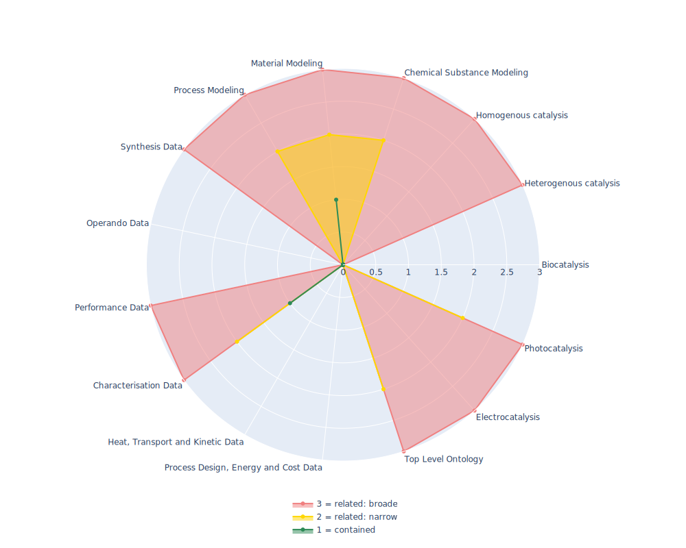

## AFO - Allotrope Foundation Ontology

 ## Radarplot 

 [HTML-Version](../radarplots/Radarplot_AFO.html)  
## Ontology

|Aspect |Description| 
 |:---|:---|
| Full Name | Allotrope Foundation Ontology |
| Synonyms/Alternative Names | Allotrope Foundation Ontologies |
| Ontology Acronym | AFO |
| Creator(s) & Issuing Organisation | Allotrope Foundation |
| Nature of Organisational Structure | Industrial Consortium |

## References

|Aspect |Description| 
 |:---|:---|
| Organisational Website | https://www.allotrope.org/ |
| Persistent URI of Ontology File | http://purl.allotrope.org/voc/afo/merged/REC/2023/09/merged-without-qudt-and-inferred.ttl |
| Link to Documentation | https://www.allotrope.org/resources  |
| Link to Version directory | https://allotrope.jfrog.io/ui/repos/tree/General/AFO-release-public |
| Optional links (Papers, Repos,...) | https://www.allotrope.org/resources |

## Ontology Modeling And Availability

|Aspect |Description| 
 |:---|:---|
| Ontology Formats Provided | ttl |
| Degree of Inference/Composition | Inferred & non-inferred; Compacted & non-compacted |
| License | Creative Commons Attribution 4.0 International License |
| Validated Resoning with | - |
| Shortest reasoning time | - |
| Aligned with Top Level Ontology | BFO (https://bioportal.bioontology.org/ontologies/AFO) |
| Imports Ontology(ies) | https://bioportal.bioontology.org/ontologies/AFO/?p=mappings |
| Prefixes used | dcterms; skos; |
| Class annotation types | skos:PrefLabel, rdfs:Definition |

## Domain of Interest Represented (contained, related: broader/narrower, missing)

|Aspect |Description| 
 |:---|:---|
| Top Level Ontology | related: narrower |
| Process Design, Energy and Cost Data | missing |
| Heat, Transport and Kinetic Data | missing |
| Characterisation Data | contained |
| Performance Data | related: broader |
| Operando Data | missing |
| Synthesis Data | related: broader |
| Process Modeling | related: narrower |
| Material Modeling | contained |
| Chemical Substance Modeling | related: narrower |
| Photocatalysis | related:narrower |
| Electrocatalysis | related: broader |
| Heterogenous catalysis | related: broader |
| Homogenous catalysis | related: broader |
| Biocatalysis | missing |

## Ontology Characteristics

|Aspect |Description| 
 |:---|:---|
| Axioms | 24686 |
| Logical | 5299 |
| Declaration | 3347 |
| Class count | 2876 |
| Object property count | 294 |
| Data property count | 24 |
| Individual count | 42 |
| Annotation Property count | 116 |

## Comments

No persistant URL to ontology-file available, thus a copy of the ontology is hosted in this github-repo in subdirectory ./ontologies/ 
No reasoning possible with FacT++ , as problems with xml:date persist.

Reasoning works with HermiT. Listed below are the number of axioms of the respective subview of the AFO
afo/rec/2022/09/afo.ttl -> 15268    INFO  09:43:25  Ontologies processed in 27652 ms by HermiT
afo/CR/2022/09/afo.ttl -> 54
afo/WD/2022/09/afo.ttl -> 15365  INFO  09:44:46  Ontologies processed in 5545 ms by HermiT
afo/merged/REC/2022/09/merged -> 40505
afo/merged/REC/2022/09/merged-without-qudt -> 24409   INFO  09:49:23  Ontologies processed in 72411 ms by HermiT
afo/merged/REC/2022/09/merged-without-qudt-inferred -> 24605    INFO  09:52:24  Ontologies processed in 109828 ms by HermiT
afo/merged/CR/2022/09/merged -> 40526
afo/merged/CR/2022/09/merged-without-qudt -> 24431  INFO  09:54:34  Ontologies processed in 84000 ms by HermiT
afo/merged/CR/2022/09/merged-without-qudt-inferred -> 24686 INFO  09:59:11  Ontologies processed in 77669 ms by HermiT
