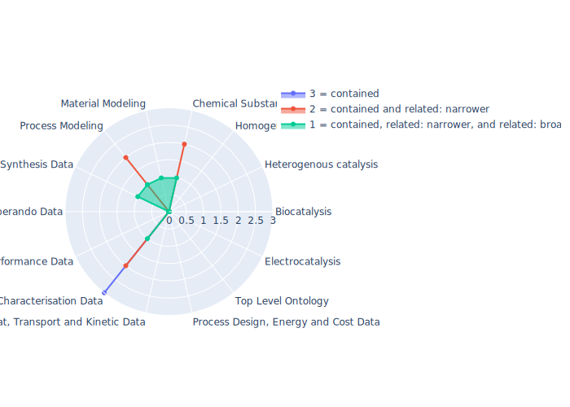

## BAO - BioAssay Ontology

 ## Radarplot 

 [HTML-Version](../radarplots/Radarplot_BAO.html)  
## Ontology

|Aspect |Description| 
 |:---|:---|
| Full Name | BioAssay Ontology |
| Synonyms/Alternative Names | - |
| Ontology Acronym | BAO |
| Creator(s) & Issuing Organisation | Hande Küçük McGinty, Janice Kranz, Joseph Ostrow, Alex Clark, Yu Lin, Saminda Abeyruwan, Uma Vempati, Kunie Sakurai, Vance Lemmon, Ubbo Visser, John Turner, Nicolette Ross, Joan Glenny-Pescov, Jiaming Hu, Caty Chung, Stephan Schurer* |
| Nature of Organisational Structure | University of Miami, Ontology is still actively maintained |

## References

|Aspect |Description| 
 |:---|:---|
| Organisational Website | http://bioassayontology.org/ |
| Persistent URI of Ontology File | https://raw.githubusercontent.com/BioAssayOntology/BAO/master/bao_complete_merged.owl |
| Link to Documentation | - |
| Link to Version directory | https://github.com/BioAssayOntology |
| Optional links (Papers, Repos,...) | doi:10.1186/2041-1480-5-S1-S5 ; doi:10.1371/journal.pone.0049198  ; doi:10.1186/1471-2105-12-257 |

## Ontology Modeling And Availability

|Aspect |Description| 
 |:---|:---|
| Ontology Formats Provided | owl |
| Degree of Inference/Composition | non inferred, available as merged version |
| License | CC-BY-4.0 |
| Validated Resoning with | FaCT++, HermiT |
| Shortest reasoning time | 215 ms |
| Aligned with Top Level Ontology | - |
| Imports Ontology(ies) | - |
| Prefixes used | bao,bao1,cellline,core,dc,efo,foaf,obo,oboInOwl,owl,protege,rdf,rdfs,skos,xml,xsd |
| Class annotation types | rdfs:label, OBO:IAO_0000115 for textual definitions |

## Domain of Interest Represented (contained, related: broader/narrower, missing)

|Aspect |Description| 
 |:---|:---|
| Top Level Ontology | missing |
| Process Design, Energy and Cost Data | missing |
| Heat, Transport and Kinetic Data | missing |
| Characterisation Data | contained |
| Performance Data | missing |
| Operando Data | missing |
| Synthesis Data | related: broader |
| Process Modeling | related: narrower |
| Material Modeling | related: broader |
| Chemical Substance Modeling | related: narrower |
| Photocatalysis | related:broader |
| Electrocatalysis | missing |
| Heterogenous catalysis | missing |
| Homogenous catalysis | missing |
| Biocatalysis | related:narrower |

## Ontology Characteristics

|Aspect |Description| 
 |:---|:---|
| Axioms | 92149 |
| Logical | 10052 |
| Declaration | 7838 |
| Class count | 7512 |
| Object property count | 170 |
| Data property count | 58 |
| Individual count | 1 |
| Annotation Property count | 100 |

## Comments

Describes chemical biology screening assays and their results including high-throughput screening (HTS) data for the purpose of categorizing assays and data analysis.
Quite applied and in active development, see also here: http://bioassayontology.org/bao-bioportal/ 
