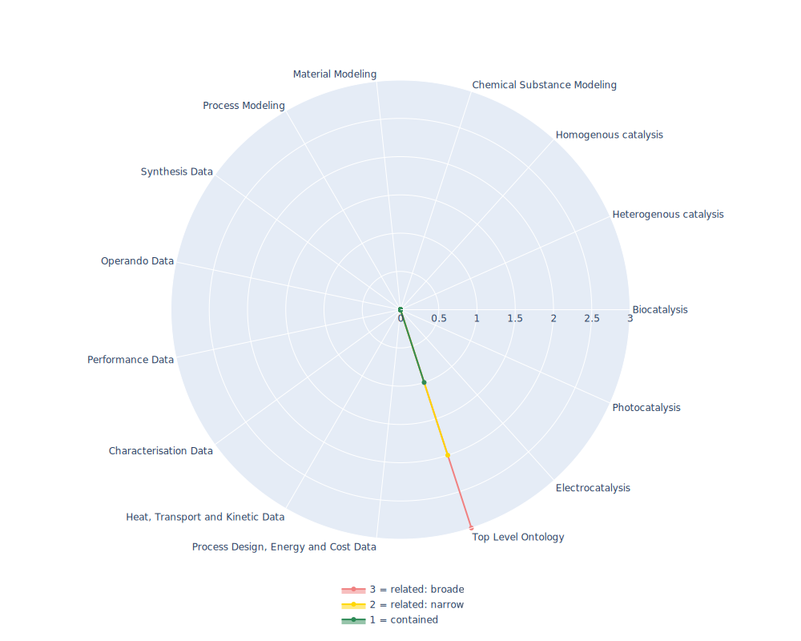

## BFO - Basic Formal Ontology

 ## Radarplot 

 [HTML-Version](../radarplots/Radarplot_BFO.html)  
## Ontology

|Aspect |Description| 
 |:---|:---|
| Full Name | Basic Formal Ontology |
| Synonyms/Alternative Names | Basic Formal Ontology 2.0, BFO2.0 |
| Ontology Acronym | BFO |
| Creator(s) & Issuing Organisation | Volkswagen Foundation, Barry Smith, and Pierre Grenon initial authors. More important contributions by many people |
| Nature of Organisational Structure | ISO Standard |

## References

|Aspect |Description| 
 |:---|:---|
| Organisational Website | https://basic-formal-ontology.org/ |
| Persistent URI of Ontology File | http://purl.obolibrary.org/obo/bfo/2.0/bfo.owl |
| Link to Documentation | https://raw.githubusercontent.com/BFO-ontology/BFO/master/docs/bfo2-reference/BFO2-Reference.pdf |
| Link to Version directory | - |
| Optional links (Papers, Repos,...) | https://github.com/BFO-ontology/BFO |

## Ontology Modeling And Availability

|Aspect |Description| 
 |:---|:---|
| Ontology Formats Provided | owl, obo |
| Degree of Inference/Composition | non inferred |
| License | CC-BY-4.0  |
| Validated Resoning with | HermiT, FaCT++ |
| Shortest reasoning time | 25ms |
| Aligned with Top Level Ontology | is TLO |
| Imports Ontology(ies) | - |
| Prefixes used | dc elements, rdfs, foaf, obo |
| Class annotation types | rdfs:label, Definition: obo:IAO_0000115 (http://purl.obolibrary.org/obo/IAO_0000115)  |

## Domain of Interest Represented (contained, related: broader/narrower, missing)

|Aspect |Description| 
 |:---|:---|
| Top Level Ontology | contained |
| Process Design, Energy and Cost Data | missing |
| Heat, Transport and Kinetic Data | missing |
| Characterisation Data | missing |
| Performance Data | missing |
| Operando Data | missing |
| Synthesis Data | missing |
| Process Modeling | missing |
| Material Modeling | missing |
| Chemical Substance Modeling | missing |
| Photocatalysis | missing |
| Electrocatalysis | missing |
| Heterogenous catalysis | missing |
| Homogenous catalysis | missing |
| Biocatalysis | missing |

## Ontology Characteristics

|Aspect |Description| 
 |:---|:---|
| Axioms | 575 |
| Logical | 52 |
| Declaration | 55 |
| Class count | 35 |
| Object property count | 0 |
| Data property count | 0 |
| Individual count | 0 |
| Annotation Property count | 24 |

## Comments

Please see the project site https://github.com/BFO-ontology/BFO, the bfo2 owl discussion group http://groups.google.com/group/bfo-owl-devel, the bfo2 discussion group http://groups.google.com/group/bfo-devel, the tracking google doc http://goo.gl/IlrEE, and the current version of the bfo2 reference http://purl.obolibrary.org/obo/bfo/dev/bfo2-reference.docx. This ontology is generated from a specification at https://github.com/BFO-ontology/BFO/tree/master/src/ontology/owl-group/specification/ and with the code that generates the OWL version in https://github.com/BFO-ontology/BFO/tree/master/src/tools/. A very early version of BFO version 2 in CLIF is at http://purl.obolibrary.org/obo/bfo/dev/bfo.clif.
This BFO 2.0 version represents a major update to BFO and is not strictly backwards compatible with BFO 1.1. The previous OWL version of BFO, version 1.1.1 will remain available at http://ifomis.org/bfo/1.1 and will no longer be updated. The BFO 2.0 OWL is a classes-only specification. The incorporation of core relations has been held over for a later version.
No object properties contained in BFO
