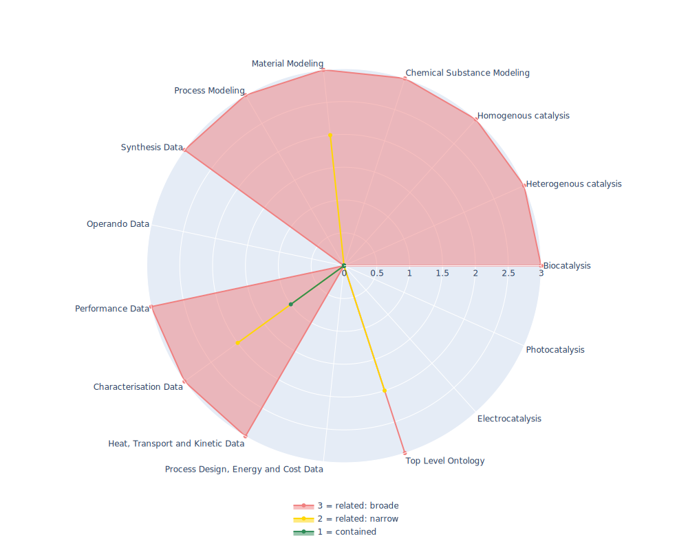

## CHEMINF - Chemical Information Ontology

 ## Radarplot 

 [HTML-Version](../radarplots/Radarplot_CHEMINF.html)  
## Ontology

|Aspect |Description| 
 |:---|:---|
| Full Name | Chemical Information Ontology |
| Synonyms/Alternative Names | - |
| Ontology Acronym | CHEMINF |
| Creator(s) & Issuing Organisation | Egon Willighagen; Cristian Munteanu; Evan Bolton; Gang Fu; Janna Hastings; Leonid Chepelev; Mark Davies; Michel Dumontier |
| Nature of Organisational Structure | Standardization Body |

## References

|Aspect |Description| 
 |:---|:---|
| Organisational Website | https://github.com/semanticchemistry/semanticchemistry |
| Persistent URI of Ontology File | http://semanticchemistry.github.io/semanticchemistry/ontology/cheminf.owl |
| Link to Documentation | - |
| Link to Version directory | - |
| Optional links (Papers, Repos,...) | https://doi.org/10.1371/journal.pone.0025513 |

## Ontology Modeling And Availability

|Aspect |Description| 
 |:---|:---|
| Ontology Formats Provided | owl |
| Degree of Inference/Composition | not defined |
| License | Creative Commons CC0 1.0  |
| Validated Resoning with | 21 Inconsistency in HermiT, FacT++ crashes Protege |
| Shortest reasoning time | - |
| Aligned with Top Level Ontology | OBO |
| Imports Ontology(ies) | its own subontologies http://semanticchemistry.github.io/semanticchemistry/ontology/cdk.owl"; "http://semanticchemistry.github.io/semanticchemistry/ontology/cheminf-algorithms.owl"; "http://semanticchemistry.github.io/semanticchemistry/ontology/cheminf-core.owl"; "http://semanticchemistry.github.io/semanticchemistry/ontology/cheminf-external.owl"/> |
| Prefixes used | dcterms; |
| Class annotation types | rdfs:label, dc:description |

## Domain of Interest Represented (contained, related: broader/narrower, missing)

|Aspect |Description| 
 |:---|:---|
| Top Level Ontology | related: narrower |
| Process Design, Energy and Cost Data | missing |
| Heat, Transport and Kinetic Data | related: broader |
| Characterisation Data | contained |
| Performance Data | related: broader |
| Operando Data | missing |
| Synthesis Data | related: broader |
| Process Modeling | related: broader |
| Material Modeling | related: narrower |
| Chemical Substance Modeling | related: broader |
| Photocatalysis | missing |
| Electrocatalysis | missing |
| Heterogenous catalysis | related: broader |
| Homogenous catalysis | related: broader |
| Biocatalysis | related: broader |

## Ontology Characteristics

|Aspect |Description| 
 |:---|:---|
| Axioms | 7555 |
| Logical | 1591 |
| Declaration | 1070 |
| Class count | 850 |
| Object property count | 111 |
| Data property count | 7 |
| Individual count | 20 |
| Annotation Property count | 85 |

## Comments

This Ontology has a lot of very specific classes and atributes allowing for a description of atmoic properties (like band gap), however due to the lack of conceptualisation a "bond dissociation Gibbs energetic descriptor" is just three classes away from its basicly central superclass 'chemical descriptor'. (this is a bit to simplified, since neither an enthalpy/entropy nor Gibbs energy is well separated, semantically and topologically differentiated)
