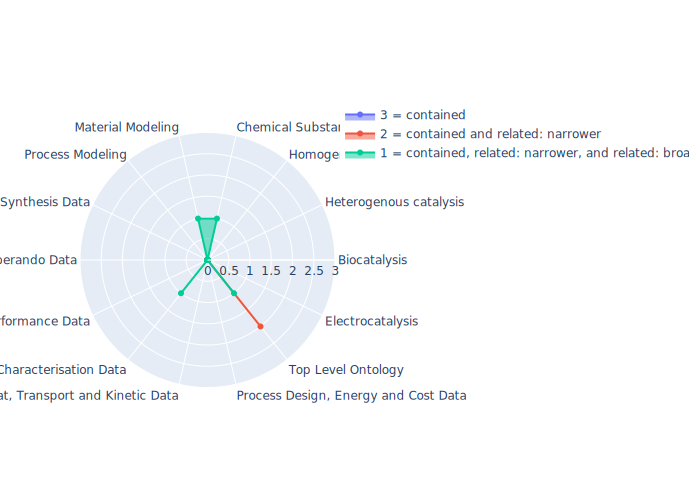

## CIF - Crystallographic Information Framework Ontology

 ## Radarplot 

 [HTML-Version](../radarplots/Radarplot_CIF.html)  
## Ontology

|Aspect |Description| 
 |:---|:---|
| Full Name | Crystallographic Information Framework Ontology |
| Synonyms/Alternative Names | EMMO-CIF-Ontology |
| Ontology Acronym | CIF |
| Creator(s) & Issuing Organisation | EMMC ASBL, European Materials Modelling Council, Silversquare Stéphanie, Avenue Louise 54, 1050 Brussels, CBE no: 0731 621 312; Creators:Emanuele Ghedini, University of Bologne; Gerhard Goldbeck, Goldbeck Consulting; Jesper Friis, SINTEF; Adham Hashibon, Fraunhofer IWM; Georg Schmitz, ACCESS |
| Nature of Organisational Structure | Standardization Body |

## References

|Aspect |Description| 
 |:---|:---|
| Organisational Website | https://github.com/emmo-repo/CIF-ontology |
| Persistent URI of Ontology File | https://raw.githubusercontent.com/emmo-repo/domain-crystallography/master/crystallography.ttl |
| Link to Documentation | https://github.com/emmo-repo/CIF-ontology |
| Link to Version directory | https://github.com/emmo-repo/CIF-ontology |
| Optional links (Papers, Repos,...) | - |

## Ontology Modeling And Availability

|Aspect |Description| 
 |:---|:---|
| Ontology Formats Provided | ttl |
| Degree of Inference/Composition | unknown |
| License | CC-BY-4.0 ? The emmo repo is cc-by-4 the subrepo which should have its own licence has none attached |
| Validated Resoning with | Fact++, HermiT |
| Shortest reasoning time | 15 ms |
| Aligned with Top Level Ontology | EMMO |
| Imports Ontology(ies) | cif-core and emmo-inferred-chemistry2 |
| Prefixes used | - |
| Class annotation types | skos:PrefLabel, rdfs:comment |

## Domain of Interest Represented (contained, related: broader/narrower, missing)

|Aspect |Description| 
 |:---|:---|
| Top Level Ontology | related: narrower |
| Process Design, Energy and Cost Data | missing |
| Heat, Transport and Kinetic Data | missing |
| Characterisation Data | related: broader |
| Performance Data | missing |
| Operando Data | missing |
| Synthesis Data | missing |
| Process Modeling | missing |
| Material Modeling | related: broader |
| Chemical Substance Modeling | related: broader |
| Photocatalysis | missing |
| Electrocatalysis | missing |
| Heterogenous catalysis | missing |
| Homogenous catalysis | missing |
| Biocatalysis | missing |

## Ontology Characteristics

|Aspect |Description| 
 |:---|:---|
| Axioms | 15178 |
| Logical | 3718 |
| Declaration | 1896 |
| Class count | 1806 |
| Object property count | 47 |
| Data property count | 9 |
| Individual count | 1 |
| Annotation Property count | 42 |

## Comments

Since the ontology is still in development (and looks as well as feels like being under development) no final comment can be made, however currently several Pitfall as defined by https://oops.linkeddata.es/ are inside the ontology as well as no good link to the "latest" version of the Ontology is currently provided, therefore the Ontology is not recommended to be used
