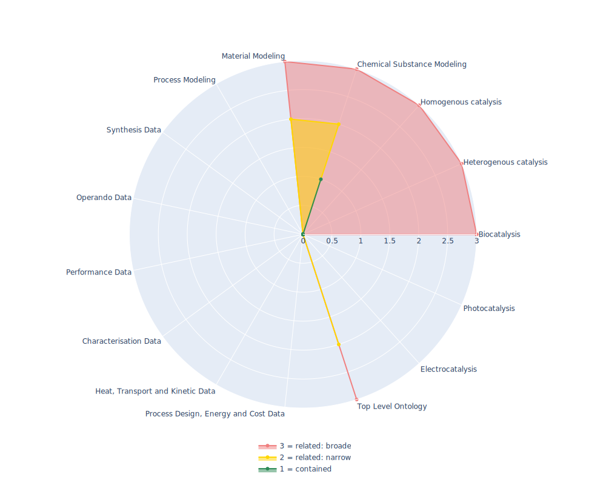

## ChEBI - Chemical Entities of Biological Interest

 ## Radarplot 

 [HTML-Version](../radarplots/Radarplot_ChEBI.html)  
## Ontology

|Aspect |Description| 
 |:---|:---|
| Full Name | Chemical Entities of Biological Interest |
| Synonyms/Alternative Names | chebi_ontology |
| Ontology Acronym | ChEBI |
| Creator(s) & Issuing Organisation | Michael Ashburner & Pankaj Jaiswal. |
| Nature of Organisational Structure | ChEBI curation team |

## References

|Aspect |Description| 
 |:---|:---|
| Organisational Website | https://www.ebi.ac.uk/chebi/init.do |
| Persistent URI of Ontology File | http://purl.obolibrary.org/obo/chebi.owl |
| Link to Documentation | Documentation available at organisational website (user manual, annotation manual, developer manual), but seem to have no permalinks, but are google documents |
| Link to Version directory | https://ftp.ebi.ac.uk/pub/databases/chebi/ontology/ |
| Optional links (Papers, Repos,...) | Hastings J, Owen G, Dekker A, Ennis M, Kale N, Muthukrishnan V, Turner S, Swainston N, Mendes P, Steinbeck C. (2016). ChEBI in 2016: Improved services and an expanding collection of metabolites. Nucleic Acids Res. More info on available formats etc.: https://www.ebi.ac.uk/chebi/downloadsForward.do |

## Ontology Modeling And Availability

|Aspect |Description| 
 |:---|:---|
| Ontology Formats Provided | sdf; owl; obo; flat file; Oracle binary table dump; SQL table dump |
| Degree of Inference/Composition | not defined |
| License | Creative Commons 4.0 (CC BY 4.0) |
| Validated Resoning with | HermiT |
| Shortest reasoning time | 128730 ms |
| Aligned with Top Level Ontology | OBO |
| Imports Ontology(ies) | only self |
| Prefixes used | obo;chebi;xsd;rdfs;xml;rdf;owl;oboInOwl;chebi1;chebi2;chebi3;chebi4 |
| Class annotation types | rdfs:Label, obo:Definition (IAO_0000115) |

## Domain of Interest Represented (contained, related: broader/narrower, missing)

|Aspect |Description| 
 |:---|:---|
| Top Level Ontology | related: narrower |
| Process Design, Energy and Cost Data | missing |
| Heat, Transport and Kinetic Data | missing |
| Characterisation Data | missing |
| Performance Data | missing |
| Operando Data | missing |
| Synthesis Data | missing |
| Process Modeling | missing |
| Material Modeling | related: narrower |
| Chemical Substance Modeling | contained |
| Photocatalysis | missing |
| Electrocatalysis | missing |
| Heterogenous catalysis | related: broader |
| Homogenous catalysis | related: broader |
| Biocatalysis | related: broader |

## Ontology Characteristics

|Aspect |Description| 
 |:---|:---|
| Axioms | 2928713 |
| Logical | 317346 |
| Declaration | 176920 |
| Class count | 176873 |
| Object property count | 10 |
| Data property count | 0 |
| Individual count | 0 |
| Annotation Property count | 37 |

## Comments

contains plenty of substance names and short definition as string, as well as additional information on molecules like Average Mass, aligned partially to NIST,IUPAC, NC-IUBMB
