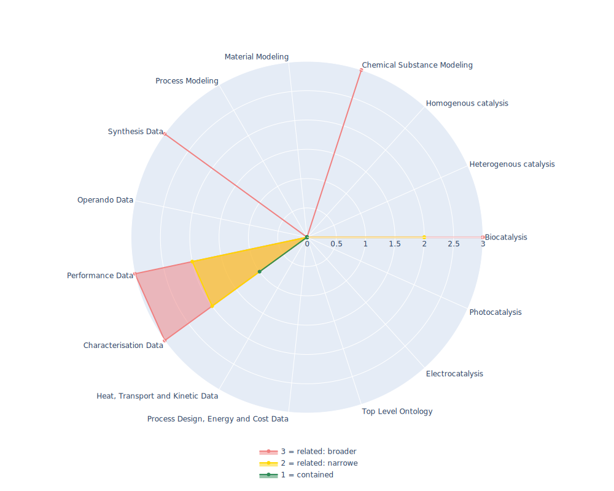

## EDAM - EDAM - Bioscientific data analysis ontology

 ## Radarplot 

 [HTML-Version](../radarplots/Radarplot_EDAM.html)  
## Ontology

|Aspect |Description| 
 |:---|:---|
| Full Name | EDAM - Bioscientific data analysis ontology |
| Synonyms/Alternative Names | - |
| Ontology Acronym | EDAM |
| Creator(s) & Issuing Organisation | Melissa Black, Lucie Lamothe, Hager Eldakroury, Mads Kierkegaard, Ankita Priya, Anne Machinda, Uttam Singh Khanduja, Drashti Patoliya, Rashika Rathi, Tawah Peggy Che Nico, Gloria Umutesi, Claudia Blankenburg, Anita Op, Precious Chieke, Omodolapo Babatunde, Steve Laurie, Steffen Neumann, Veit Schwämmle, Ivan Kuzmin, Chris Hunter, Jonathan Karr, Jon Ison, Alban Gaignard, Bryan Brancotte, Hervé Ménager, Matúš Kalaš  |
| Nature of Organisational Structure | Group of MaintainersMaintainer |

## References

|Aspect |Description| 
 |:---|:---|
| Organisational Website | https://github.com/edamontology/edamontology |
| Persistent URI of Ontology File | http://edamontology.org/EDAM.owl |
| Link to Documentation | https://edamontology.github.io/edam-browser |
| Link to Version directory | https://github.com/edamontology/edamontology/tree/main/releases |
| Optional links (Papers, Repos,...) | https://doi.org/10.7490/f1000research.1118900.1  |

## Ontology Modeling And Availability

|Aspect |Description| 
 |:---|:---|
| Ontology Formats Provided | ttl |
| Degree of Inference/Composition | non-inferred; non-compacted |
| License | GNU LGPL v3.0 |
| Validated Resoning with | Fact++ |
| Shortest reasoning time | 1910 ms |
| Aligned with Top Level Ontology | None |
| Imports Ontology(ies) | None |
| Prefixes used | - |
| Class annotation types | rdfs:Label; rdfs:comment |

## Domain of Interest Represented (contained, related: broader/narrower, missing)

|Aspect |Description| 
 |:---|:---|
| Top Level Ontology | missing |
| Process Design, Energy and Cost Data | missing |
| Heat, Transport and Kinetic Data | missing |
| Characterisation Data | contained |
| Performance Data | related: narrower |
| Operando Data | missing |
| Synthesis Data | related: broader |
| Process Modeling | missing |
| Material Modeling | missing |
| Chemical Substance Modeling | related: broader |
| Photocatalysis | missing |
| Electrocatalysis | missing |
| Heterogenous catalysis | missing |
| Homogenous catalysis | missing |
| Biocatalysis | related: narrower |

## Ontology Characteristics

|Aspect |Description| 
 |:---|:---|
| Axioms | 34927 |
| Logical | 5179 |
| Declaration | 3550 |
| Class count | 3473 |
| Object property count | 12 |
| Data property count | 0 |
| Individual count | 0 |
| Annotation Property count | 70 |

## Comments

An Ontology consisting of several Terms relevant for DANN and Enzymatic activity. Imports OBO Ontology terms and classes while not being alligned to an Ontology. Good representation for description of proteins and enzyme kinetics.
EDAM is a domain ontology of data analysis and data management in bio- and other sciences, and science-based applications. It comprises concepts related to analysis, modelling, optimisation, and data life-cycle. 
