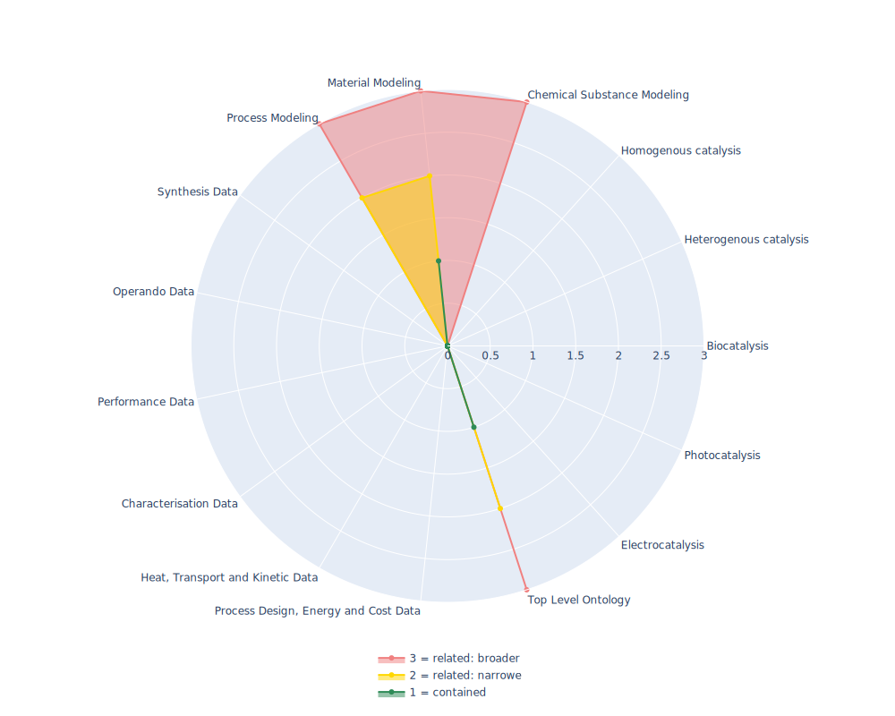

## EMMO - Elementary Multiperspective Material Ontology

 ## Radarplot 

 [HTML-Version](../radarplots/Radarplot_EMMO.html)  
## Ontology

|Aspect |Description| 
 |:---|:---|
| Full Name | Elementary Multiperspective Material Ontology |
| Synonyms/Alternative Names | previously European Material Modeling Ontology |
| Ontology Acronym | EMMO |
| Creator(s) & Issuing Organisation | EMMC ASBL, European Materials Modelling Council, Silversquare Stéphanie, Avenue Louise 54, 1050 Brussels, CBE no: 0731 621 312; Creators:Emanuele Ghedini, University of Bologne; Gerhard Goldbeck, Goldbeck Consulting; Jesper Friis, SINTEF; Adham Hashibon, Fraunhofer IWM; Georg Schmitz, ACCESS |
| Nature of Organisational Structure | Standardization Body |

## References

|Aspect |Description| 
 |:---|:---|
| Organisational Website | https://emmc.eu/ |
| Persistent URI of Ontology File | https://emmo-repo.github.io/versions/1.0.0-beta4/emmo.owl |
| Link to Documentation | https://emmo-repo.github.io/ |
| Link to Version directory | https://emmo-repo.github.io/ |
| Optional links (Papers, Repos,...) | GitHub.com: https://github.com/emmo-repo/EMMO; EMMOpy: https://github.com/emmo-repo/EMMOntoPy;  |

## Ontology Modeling And Availability

|Aspect |Description| 
 |:---|:---|
| Ontology Formats Provided | rdf/xml; ttl |
| Degree of Inference/Composition | Inferred & non-inferred; Compacted & non-compacted |
| License | Creative Commons Attribution 4.0 International Public License |
| Validated Resoning with | Fact++, HermiT |
| Shortest reasoning time | - |
| Aligned with Top Level Ontology | - |
| Imports Ontology(ies) | - |
| Prefixes used | dcterms; skos; |
| Class annotation types | skos:PrefLabel, rdfs:Definition |

## Domain of Interest Represented (contained, related: broader/narrower, missing)

|Aspect |Description| 
 |:---|:---|
| Top Level Ontology | contained |
| Process Design, Energy and Cost Data | missing |
| Heat, Transport and Kinetic Data | missing |
| Characterisation Data | missing |
| Performance Data | missing |
| Operando Data | missing |
| Synthesis Data | missing |
| Process Modeling | related: narrower |
| Material Modeling | contained |
| Chemical Substance Modeling | related: broader |
| Photocatalysis | missing |
| Electrocatalysis | missing |
| Heterogenous catalysis | missing |
| Homogenous catalysis | missing |
| Biocatalysis | missing |

## Ontology Characteristics

|Aspect |Description| 
 |:---|:---|
| Axioms | 7382 |
| Logical | 2527 |
| Declaration | 1055 |
| Class count | 935 |
| Object property count | 90 |
| Data property count | 5 |
| Individual count | 1 |
| Annotation Property count | 32 |

## Comments

-
