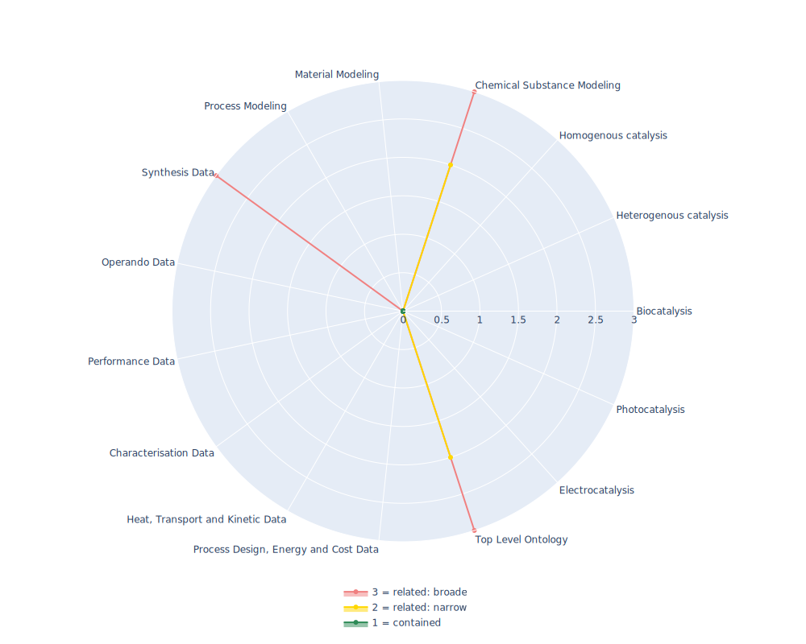

## ENMO - eNanoMapper Ontology

 ## Radarplot 

 [HTML-Version](../radarplots/Radarplot_ENMO.html)  
## Ontology

|Aspect |Description| 
 |:---|:---|
| Full Name | eNanoMapper Ontology |
| Synonyms/Alternative Names | - |
| Ontology Acronym | ENMO |
| Creator(s) & Issuing Organisation | EnanoMapper |
| Nature of Organisational Structure | Maintained by several EU H2020 projects (see GitHub repository linked in references) |

## References

|Aspect |Description| 
 |:---|:---|
| Organisational Website | https://www.enanomapper.net/ |
| Persistent URI of Ontology File | https://raw.githubusercontent.com/enanomapper/ontologies/refs/heads/master/enanomapper.owl |
| Link to Documentation | https://oborel.github.io/obo-relations/ |
| Link to Version directory | https://github.com/enanomapper/ontologies |
| Optional links (Papers, Repos,...) | https://zenodo.org/records/8139894  |

## Ontology Modeling And Availability

|Aspect |Description| 
 |:---|:---|
| Ontology Formats Provided | owl |
| Degree of Inference/Composition | non inferred |
| License | CC-BY 3.0 |
| Validated Resoning with | HermiT |
| Shortest reasoning time | 59129 ms |
| Aligned with Top Level Ontology | BFO |
| Imports Ontology(ies) | - |
| Prefixes used | bibo,ccont,cheminf,cheminf-core,cheminf2,chmo,cito,core,core4,dc,efo,entity_attribute,entity_attribute3,entity_quality,envo,foaf,foo,ncbitaxon,npo,obo,obo1,oboInOwl,owl,pato,patterns,pav,protege,rdf,rdfs,resource,skos,subsets,terms,uberon,uo,vann, |
| Class annotation types | rdfs:label, OBO:IAO_0000115 for textual definitions |

## Domain of Interest Represented (contained, related: broader/narrower, missing)

|Aspect |Description| 
 |:---|:---|
| Top Level Ontology | related: narrower |
| Process Design, Energy and Cost Data | missing |
| Heat, Transport and Kinetic Data | missing |
| Characterisation Data | missing |
| Performance Data | missing |
| Operando Data | missing |
| Synthesis Data | related: broader |
| Process Modeling | missing |
| Material Modeling | missing |
| Chemical Substance Modeling | related: narrower |
| Photocatalysis | missing |
| Electrocatalysis | missing |
| Heterogenous catalysis | missing |
| Homogenous catalysis | missing |
| Biocatalysis | missing |

## Ontology Characteristics

|Aspect |Description| 
 |:---|:---|
| Axioms | 209015 |
| Logical | 29556 |
| Declaration | 27269 |
| Class count | 25795 |
| Object property count | 54 |
| Data property count | 1 |
| Individual count | 697 |
| Annotation Property count | 696 |

## Comments

The eNanoMapper project (https://www.enanomapper.net/), NanoCommons project (https://www.nanocommons.eu/) and ACEnano project (http://acenano-project.eu/) are creating a pan-European computational infrastructure for toxicological data management for ENMs, based on semantic web standards and ontologies. This ontology is an application ontology targeting the full domain of nanomaterial safety assessment. It re-uses several other ontologies including the NPO, CHEMINF, ChEBI, and ENVO.
