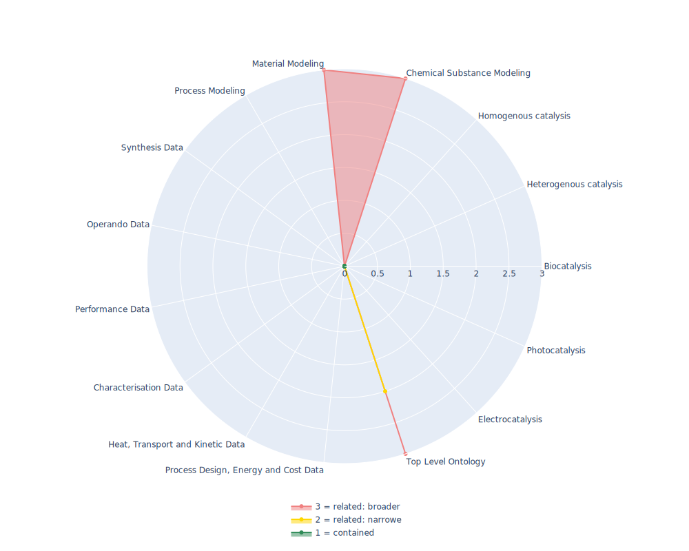

## ENVO - Environmental Ontology

 ## Radarplot 

 [HTML-Version](../radarplots/Radarplot_ENVO.html)  
## Ontology

|Aspect |Description| 
 |:---|:---|
| Full Name | Environmental Ontology |
| Synonyms/Alternative Names | EnvO |
| Ontology Acronym | ENVO |
| Creator(s) & Issuing Organisation |  Pier Luigi Buttigieg https://orcid.org/0000-0002-4366-3088;   Christopher Mungall https://orcid.org/0000-0002-6601-2165;  Suzanna Lewis https://orcid.org/0000-0002-8343-612X; Norman Morrison https://orcid.org/0000-0003-1604-1512 |
| Nature of Organisational Structure | small group |

## References

|Aspect |Description| 
 |:---|:---|
| Organisational Website | https://sites.google.com/site/environmentontology/home |
| Persistent URI of Ontology File | http://purl.obolibrary.org/obo/envo.owl |
| Link to Documentation | https://github.com/EnvironmentOntology/envo/wiki |
| Link to Version directory | https://github.com/EnvironmentOntology/envo/wiki |
| Optional links (Papers, Repos,...) | https://jbiomedsem.biomedcentral.com/articles/10.1186/2041-1480-4-43; https://jbiomedsem.biomedcentral.com/articles/10.1186/s13326-016-0097-6 |

## Ontology Modeling And Availability

|Aspect |Description| 
 |:---|:---|
| Ontology Formats Provided | rdf/xml; ttl; json; owl; obo |
| Degree of Inference/Composition | conpacted & noncompacted; obo-dangling classes |
| License | Creative Commons CC0 1.0 Universal |
| Validated Resoning with | 334407 ms by HermiT; FacT++ ran into internal error after using more than 50GB of Ram |
| Shortest reasoning time | 55min 51s |
| Aligned with Top Level Ontology | OBO |
| Imports Ontology(ies) | only self |
| Prefixes used | dc; foaf; |
| Class annotation types | rdfs:Label, obo:Definition, rdfs:comment |

## Domain of Interest Represented (contained, related: broader/narrower, missing)

|Aspect |Description| 
 |:---|:---|
| Top Level Ontology | related: narrower |
| Process Design, Energy and Cost Data | missing |
| Heat, Transport and Kinetic Data | missing |
| Characterisation Data | missing |
| Performance Data | missing |
| Operando Data | missing |
| Synthesis Data | missing |
| Process Modeling | missing |
| Material Modeling | related: broader |
| Chemical Substance Modeling | related: broader |
| Photocatalysis | missing |
| Electrocatalysis | missing |
| Heterogenous catalysis | missing |
| Homogenous catalysis | missing |
| Biocatalysis | missing |

## Ontology Characteristics

|Aspect |Description| 
 |:---|:---|
| Axioms | 49216 |
| Logical | 12270 |
| Declaration | 6846 |
| Class count | 6566 |
| Object property count | 135 |
| Data property count | 1 |
| Individual count | 44 |
| Annotation Property count | 103 |

## Comments

While it  sounds like the Ontology should describe Environemnts and its relations, such as 'Lake' 'canBePoisonedBy' 'CopperSalt' or 'Windturbine' 'generates('NoisePolution' 'some' 'dB')', it is more of a "biome-ontology", descriptions of local/abstract environments end a e.g. Wastefills.
