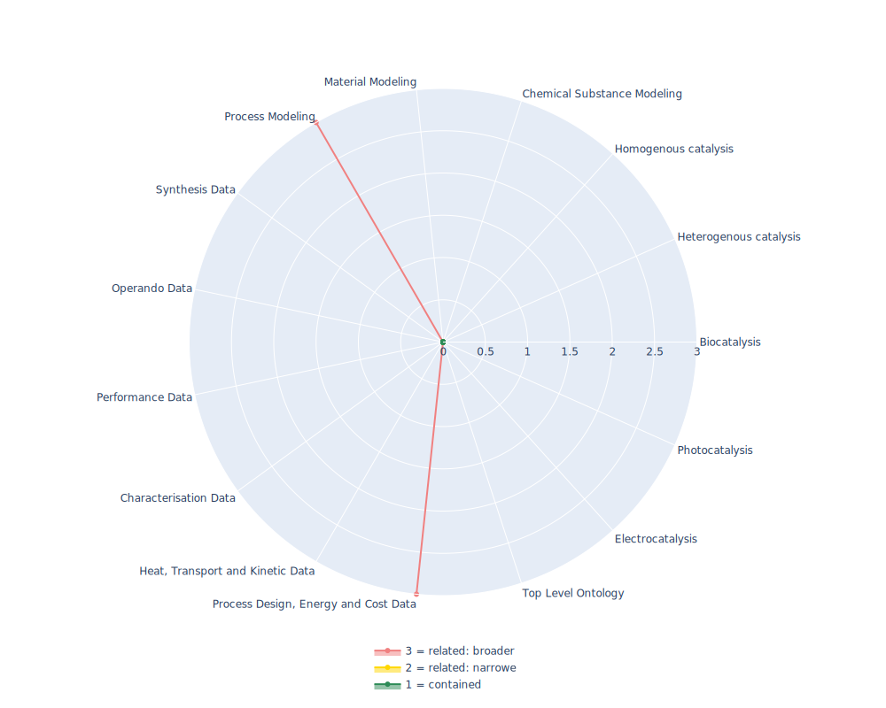

## M3 - Machine to Machine Measurements Ontology

 ## Radarplot 

 [HTML-Version](../radarplots/Radarplot_M3.html)  
## Ontology

|Aspect |Description| 
 |:---|:---|
| Full Name | Machine to Machine Measurements Ontology |
| Synonyms/Alternative Names | - |
| Ontology Acronym | M3 |
| Creator(s) & Issuing Organisation | Amelie Gyrard |
| Nature of Organisational Structure | Academia Project / PhD thesis |

## References

|Aspect |Description| 
 |:---|:---|
| Organisational Website | http://sensormeasurement.appspot.com/ |
| Persistent URI of Ontology File | http://sensormeasurement.appspot.com/m3 |
| Link to Documentation | http://sensormeasurement.appspot.com/?p=m3 |
| Link to Version directory | - |
| Optional links (Papers, Repos,...) | http://sensormeasurement.appspot.com/?p=publication  |

## Ontology Modeling And Availability

|Aspect |Description| 
 |:---|:---|
| Ontology Formats Provided | rdf/xml |
| Degree of Inference/Composition | non-inferred; non-compacted |
| License | GNU General Public License |
| Validated Resoning with | Fact++, HermiT |
| Shortest reasoning time | 31 ms |
| Aligned with Top Level Ontology | None |
| Imports Ontology(ies) | None |
| Prefixes used | - |
| Class annotation types | rdfs:Label, rdfs:comment |

## Domain of Interest Represented (contained, related: broader/narrower, missing)

|Aspect |Description| 
 |:---|:---|
| Top Level Ontology | missing |
| Process Design, Energy and Cost Data | related: broader |
| Heat, Transport and Kinetic Data | missing |
| Characterisation Data | missing |
| Performance Data | missing |
| Operando Data | missing |
| Synthesis Data | missing |
| Process Modeling | related: broader |
| Material Modeling | missing |
| Chemical Substance Modeling | missing |
| Photocatalysis | missing |
| Electrocatalysis | missing |
| Heterogenous catalysis | missing |
| Homogenous catalysis | missing |
| Biocatalysis | missing |

## Ontology Characteristics

|Aspect |Description| 
 |:---|:---|
| Axioms | 5048 |
| Logical | 1577 |
| Declaration | 616 |
| Class count | 761 |
| Object property count | 20 |
| Data property count | 13 |
| Individual count | 2 |
| Annotation Property count | 23 |

## Comments

The M3 Ontology can be considered more of a Taxonomy as it lacks definitions, sets up several equivalences which are neither well defined nor well hierarchically structured. Not really reusable. Some of the classes such as "Phosphorous" also seem to be out of place in a Internet of things Ontology , espaccially if they are not well defined (limited by a definition). The Machine-to-Machine Measurement (M3) Ontology is a unified language, nomenclature, dictionnary which enables semantically annotating heterogeneous IoT data produced by heterogeneous devices measurements (sensors, RFID tags, etc.)
