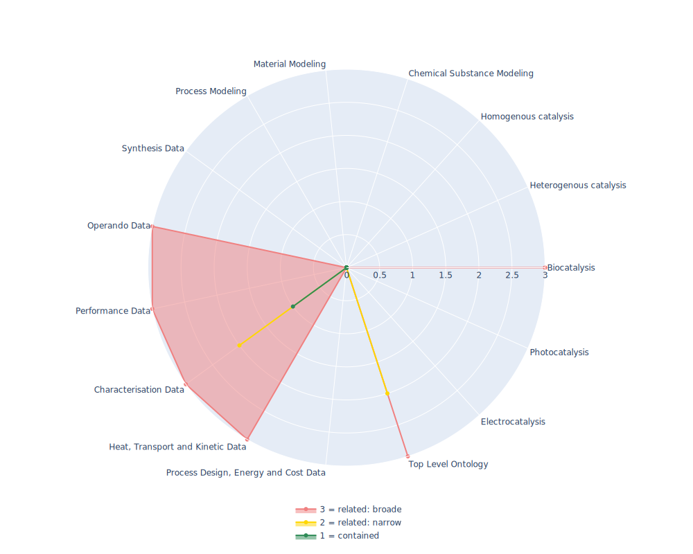

## MS - Mass Spectrometry Ontology

 ## Radarplot 

 [HTML-Version](../radarplots/Radarplot_MS.html)  
## Ontology

|Aspect |Description| 
 |:---|:---|
| Full Name | Mass Spectrometry Ontology |
| Synonyms/Alternative Names | PSI-MS, Proteomics Standards Initiative Mass Spectroscopy Ontology |
| Ontology Acronym | MS |
| Creator(s) & Issuing Organisation | HUPO Proteomics Standards Initiative |
| Nature of Organisational Structure | Standardization Body |

## References

|Aspect |Description| 
 |:---|:---|
| Organisational Website | https://www.psidev.info/groups/controlled-vocabularies |
| Persistent URI of Ontology File | http://purl.obolibrary.org/obo/ms.owl |
| Link to Documentation | https://pubmed.ncbi.nlm.nih.gov/23482073/ |
| Link to Version directory | https://github.com/HUPO-PSI/psi-ms-CV |
| Optional links (Papers, Repos,...) | https://github.com/HUPO-PSI/psi-ms-CV  |

## Ontology Modeling And Availability

|Aspect |Description| 
 |:---|:---|
| Ontology Formats Provided | rdf/xml; ttl |
| Degree of Inference/Composition | Inferred & non-inferred; Compacted & non-compacted |
| License | CC BY 4.0 |
| Validated Resoning with | - |
| Shortest reasoning time | - |
| Aligned with Top Level Ontology | OBO  |
| Imports Ontology(ies) | Pato (139.364 axioms, 31.144 logical), stato (11.674 axioms, 2.332 logical) |
| Prefixes used | rdfs, xsd |
| Class annotation types | rdfs:Label, "IAO:000015": textual definition |

## Domain of Interest Represented (contained, related: broader/narrower, missing)

|Aspect |Description| 
 |:---|:---|
| Top Level Ontology | related: narrower |
| Process Design, Energy and Cost Data | missing |
| Heat, Transport and Kinetic Data | related: broader |
| Characterisation Data | contained |
| Performance Data | related: broader |
| Operando Data | related: broader |
| Synthesis Data | missing |
| Process Modeling | missing |
| Material Modeling | missing |
| Chemical Substance Modeling | missing |
| Photocatalysis | missing |
| Electrocatalysis | missing |
| Heterogenous catalysis | missing |
| Homogenous catalysis | missing |
| Biocatalysis | related: broader |

## Ontology Characteristics

|Aspect |Description| 
 |:---|:---|
| Axioms | 175485 |
| Logical | 39135 |
| Declaration | 15623 |
| Class count | 14989 |
| Object property count | 366 |
| Data property count | 7 |
| Individual count | 14 |
| Annotation Property count | 249 |

## Comments

well implemented and structured ontology. A structured controlled vocabulary for the annotation of experiments concerned with proteomics mass spectrometry.
