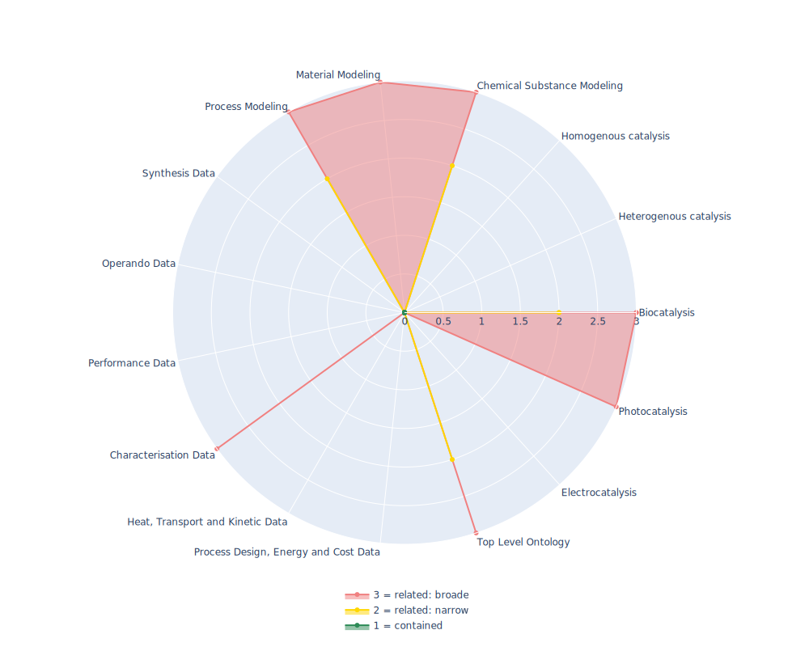

## OBI - Ontology for Biomedical Investigations

 ## Radarplot 

 [HTML-Version](../radarplots/Radarplot_OBI.html)  
## Ontology

|Aspect |Description| 
 |:---|:---|
| Full Name | Ontology for Biomedical Investigations |
| Synonyms/Alternative Names | - |
| Ontology Acronym | OBI |
| Creator(s) & Issuing Organisation | OBI Consortium |
| Nature of Organisational Structure | Consortium, Ontology is still actively maintained |

## References

|Aspect |Description| 
 |:---|:---|
| Organisational Website | https://obi-ontology.org/ |
| Persistent URI of Ontology File | http://purl.obolibrary.org/obo/obi.owl |
| Link to Documentation | https://obi-ontology.org/docs/ |
| Link to Version directory | https://github.com/obi-ontology/obi |
| Optional links (Papers, Repos,...) | doi: 10.1371/journal.pone.0154556; https://en.wikipedia.org/wiki/Ontology_for_Biomedical_Investigations |

## Ontology Modeling And Availability

|Aspect |Description| 
 |:---|:---|
| Ontology Formats Provided | owl, obo |
| Degree of Inference/Composition | non inferred, available as core version |
| License | CC-BY-4.0 |
| Validated Resoning with | HermiT |
| Shortest reasoning time | - |
| Aligned with Top Level Ontology | BFO |
| Imports Ontology(ies) | - |
| Prefixes used | dc,foaf,obo,oboInOwl,owl,protege,rdf,rdfs,terms,xml |
| Class annotation types | rdfs:label, OBO:IAO_0000115 for textual definitions |

## Domain of Interest Represented (contained, related: broader/narrower, missing)

|Aspect |Description| 
 |:---|:---|
| Top Level Ontology | related: narrower |
| Process Design, Energy and Cost Data | missing |
| Heat, Transport and Kinetic Data | missing |
| Characterisation Data | related: broader |
| Performance Data | missing |
| Operando Data | missing |
| Synthesis Data | missing |
| Process Modeling | related: narrower |
| Material Modeling | related: broader |
| Chemical Substance Modeling | related: narrower |
| Photocatalysis | related:broader |
| Electrocatalysis | missing |
| Heterogenous catalysis | missing |
| Homogenous catalysis | missing |
| Biocatalysis | related:narrower |

## Ontology Characteristics

|Aspect |Description| 
 |:---|:---|
| Axioms | 51910 |
| Logical | 10122 |
| Declaration | 5354 |
| Class count | 4866 |
| Object property count | 98 |
| Data property count | 8 |
| Individual count | 306 |
| Annotation Property count | 73 |

## Comments

Quite well formed ontology for representing biomedical investigations, including study designs, the collection and preparation of the targets of investigation, assays, instrumentation and reagents used, as well as the data generated and the types of analysis performed on the data to reach conclusions, and their documentation.
The Ontology for Biomedical Investigations (OBI) is build in a collaborative, international effort and will serve as a resource for annotating biomedical investigations, including the study design, protocols and instrumentation used, the data generated and the types of analysis performed on the data. This ontology arose from the Functional Genomics Investigation Ontology (FuGO) and will contain both terms that are common to all biomedical investigations, including functional genomics investigations and those that are more domain specific.
