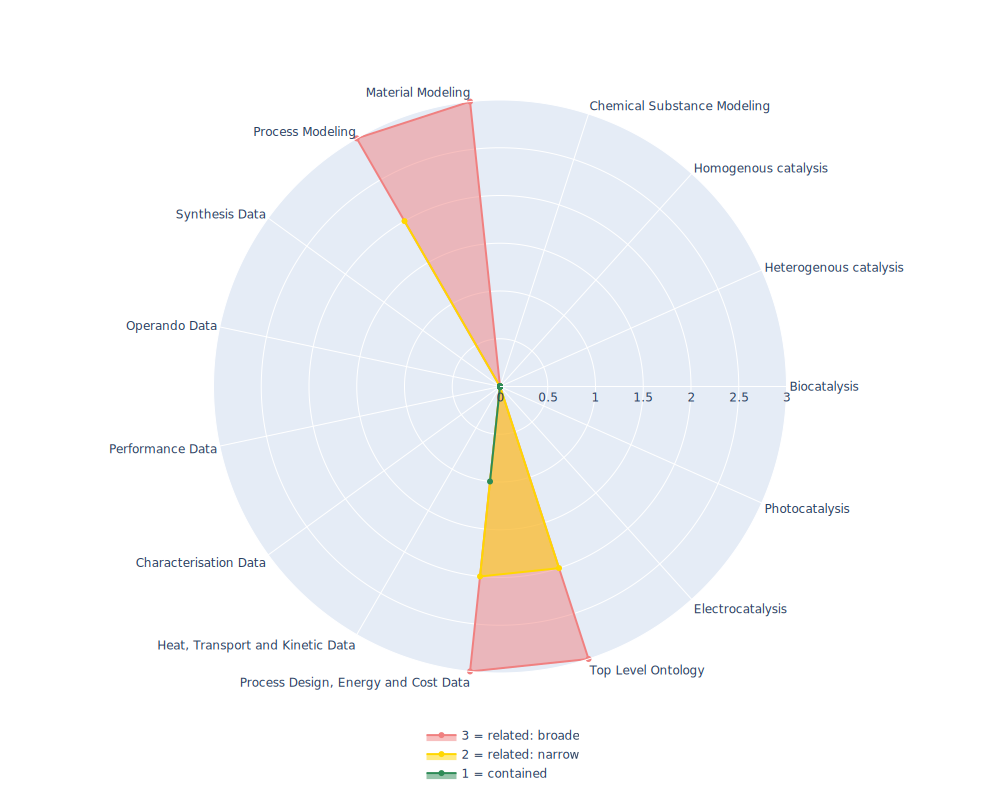

## OEO - Open Energy Ontology

 ## Radarplot 

 [HTML-Version](../radarplots/Radarplot_OEO.html)  
## Ontology

|Aspect |Description| 
 |:---|:---|
| Full Name | Open Energy Ontology |
| Synonyms/Alternative Names | - |
| Ontology Acronym | OEO |
| Creator(s) & Issuing Organisation | Open Energy Familiy |
| Nature of Organisational Structure | Ontology is still actively maintained |

## References

|Aspect |Description| 
 |:---|:---|
| Organisational Website | https://openenergyplatform.org/ |
| Persistent URI of Ontology File | https://raw.githubusercontent.com/OpenEnergyPlatform/ontology/refs/heads/master/src/ontology/oeo.omn |
| Link to Documentation | https://openenergyplatform.org/ontology/ |
| Link to Version directory | https://github.com/OpenEnergyPlatform/ontology |
| Optional links (Papers, Repos,...) | - |

## Ontology Modeling And Availability

|Aspect |Description| 
 |:---|:---|
| Ontology Formats Provided | omn / owl Manchester Syntax |
| Degree of Inference/Composition | non inferred |
| License | CC0 1.0 |
| Validated Resoning with | HermiT |
| Shortest reasoning time | 51268 ms |
| Aligned with Top Level Ontology | BFO |
| Imports Ontology(ies) | - |
| Prefixes used | bfo,dc,dct,obda,owl,rdf,rdfs,xml,xsd |
| Class annotation types | rdfs:label, OBO:IAO_0000115 for textual definitions |

## Domain of Interest Represented (contained, related: broader/narrower, missing)

|Aspect |Description| 
 |:---|:---|
| Top Level Ontology | related: narrower |
| Process Design, Energy and Cost Data | contained |
| Heat, Transport and Kinetic Data | missing |
| Characterisation Data | missing |
| Performance Data | missing |
| Operando Data | missing |
| Synthesis Data | missing |
| Process Modeling | related: narrower |
| Material Modeling | related: broader |
| Chemical Substance Modeling | missing |
| Photocatalysis | missing |
| Electrocatalysis | missing |
| Heterogenous catalysis | missing |
| Homogenous catalysis | missing |
| Biocatalysis | missing |

## Ontology Characteristics

|Aspect |Description| 
 |:---|:---|
| Axioms | 13074 |
| Logical | 3637 |
| Declaration | 1783 |
| Class count | 1376 |
| Object property count | 143 |
| Data property count | 2 |
| Individual count | 204 |
| Annotation Property count | 51 |

## Comments

modular ontology. The Open Energy Ontology is an ontology for all aspects of the energy modelling domain.
