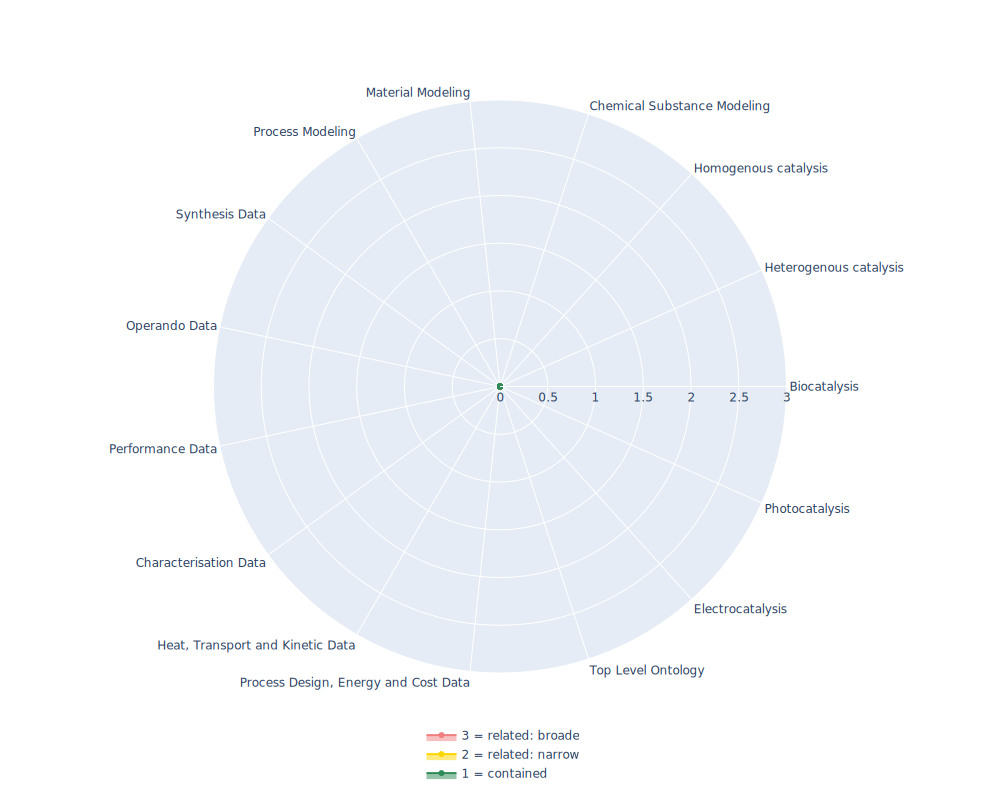

## OM - Ontology of units of Measure

 ## Radarplot 

 [HTML-Version](../radarplots/Radarplot_OM.html)  
## Ontology

|Aspect |Description| 
 |:---|:---|
| Full Name | Ontology of units of Measure |
| Synonyms/Alternative Names | - |
| Ontology Acronym | OM |
| Creator(s) & Issuing Organisation | Hajo Rijgersberg, Don Willems, Jan Top; Wageningen University and Research Centre, The Netherlands |
| Nature of Organisational Structure | University, Ontology is still actively maintained |

## References

|Aspect |Description| 
 |:---|:---|
| Organisational Website | https://www.wur.nl/en/product/ontology-of-units-of-measure-om.htm |
| Persistent URI of Ontology File | https://raw.githubusercontent.com/HajoRijgersberg/OM/master/om-2.0.rdf |
| Link to Documentation | https://github.com/HajoRijgersberg/OM |
| Link to Version directory | https://github.com/HajoRijgersberg/OM |
| Optional links (Papers, Repos,...) | 10 publications listed in GitHub Repo, two of those are: https://doi.org/10.1016/j.aei.2010.07.008. ; https://doi.org/10.3233/SW-2012-0069; further interesting read: https://www.semantic-web-journal.net/system/files/swj1825.pdf |

## Ontology Modeling And Availability

|Aspect |Description| 
 |:---|:---|
| Ontology Formats Provided | ttl, rdf/xml |
| Degree of Inference/Composition | non inferred |
| License | CC-BY-4.0 |
| Validated Resoning with | - |
| Shortest reasoning time | - |
| Aligned with Top Level Ontology | - |
| Imports Ontology(ies) | - |
| Prefixes used | bibo,dc,dct,foaf,om,ombibo,owl,rdf,rdfs,skos,wv,xml,xsd |
| Class annotation types | rdfs:label, rdfs:comment |

## Domain of Interest Represented (contained, related: broader/narrower, missing)

|Aspect |Description| 
 |:---|:---|
| Top Level Ontology | missing |
| Process Design, Energy and Cost Data | missing |
| Heat, Transport and Kinetic Data | missing |
| Characterisation Data | missing |
| Performance Data | missing |
| Operando Data | missing |
| Synthesis Data | missing |
| Process Modeling | missing |
| Material Modeling | missing |
| Chemical Substance Modeling | missing |
| Photocatalysis | missing |
| Electrocatalysis | missing |
| Heterogenous catalysis | missing |
| Homogenous catalysis | missing |
| Biocatalysis | missing |

## Ontology Characteristics

|Aspect |Description| 
 |:---|:---|
| Axioms | 23781 |
| Logical | 14458 |
| Declaration | 883 |
| Class count | 815 |
| Object property count | 23 |
| Data property count | 11 |
| Individual count | 2242 |
| Annotation Property count | 39 |

## Comments

A very good resource on any scientific unit to be described. It models concepts and relations important to scientific research. It has a strong focus on units, quantities, measurements, and dimensions.
