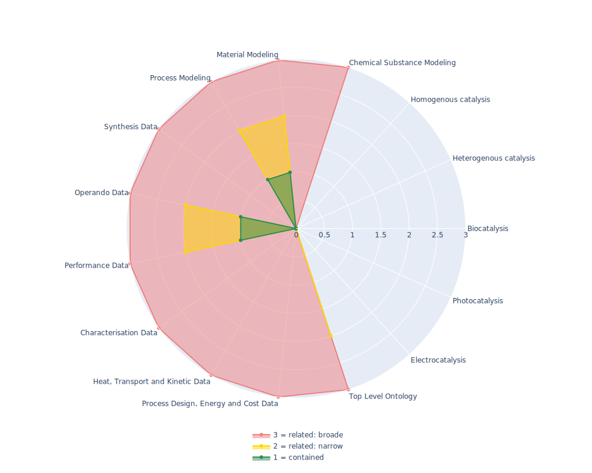

## OSMO - Ontology for Simulation, Modelling, and Optimization

 ## Radarplot 

 [HTML-Version](../radarplots/Radarplot_OSMO.html)  
## Ontology

|Aspect |Description| 
 |:---|:---|
| Full Name | Ontology for Simulation, Modelling, and Optimization |
| Synonyms/Alternative Names | - |
| Ontology Acronym | OSMO |
| Creator(s) & Issuing Organisation | https://doi.org/10.3030/760907 Virtual Materials Marketplace (VIMMP) project consortium; Andreas Fiseni; Christoph Niethammer; Daniele Toti (ORCID 0000-0002-9668-6961); Gerhard Goldbeck (ORCID 0000-0002-4181-2852); Gianluca Boccardo (ORCID 0000-0003-1264-8237); Helge Krieg; Jadran Vrabec (ORCID 0000-0002-7947-4051); Joshua D. Elliott (ORCID 0000-0002-0729-246X); Mara Chiricotto (ORCID 0000-0003-1609-5254); Paola Carbone (ORCID 0000-0001-9927-8376); Peter Schiffels; Philipp Neumann; Vladimir Lobaskin (ORCID 0000-0002-5231-0639); Welchy Leite Cavalcanti; Ilian T. Todorov (ORCID 0000-0001-7275-1784); Martin Thomas Horsch (ORCID 0000-0002-9464-6739); Michael A. Seaton (ORCID 0000-0002-4708-573X); Silvia Chiacchiera (ORCID 0000-0003-0422-7870) |
| Nature of Organisational Structure | terminated consortium of the EMMC |

## References

|Aspect |Description| 
 |:---|:---|
| Organisational Website | https://www.vimmp.eu/ |
| Persistent URI of Ontology File | http://www.molmod.info/semantics/osmo.ttl |
| Link to Documentation | - |
| Link to Version directory | https://gitlab.com/vimmp-semantics/vimmp-ontologies |
| Optional links (Papers, Repos,...) | https://zenodo.org/record/5084394 |

## Ontology Modeling And Availability

|Aspect |Description| 
 |:---|:---|
| Ontology Formats Provided | ttl |
| Degree of Inference/Composition | non inferred |
| License | GNU Lesser General Public License (LGPL) version 3 |
| Validated Resoning with | 1085049 ms by FaCT++ |
| Shortest reasoning time | - |
| Aligned with Top Level Ontology | EMMO/VIMMP |
| Imports Ontology(ies) | its own subontologies http://semanticchemistry.github.io/semanticchemistry/ontology/cdk.owl"; "http://semanticchemistry.github.io/semanticchemistry/ontology/cheminf-algorithms.owl"; "http://semanticchemistry.github.io/semanticchemistry/ontology/cheminf-core.owl"; "http://semanticchemistry.github.io/semanticchemistry/ontology/cheminf-external.owl"/> |
| Prefixes used | dcterms; skos |
| Class annotation types | skos:label, rdfs:comment |

## Domain of Interest Represented (contained, related: broader/narrower, missing)

|Aspect |Description| 
 |:---|:---|
| Top Level Ontology | related: narrower |
| Process Design, Energy and Cost Data | related: broader |
| Heat, Transport and Kinetic Data | related: broader |
| Characterisation Data | related: broader |
| Performance Data | contained |
| Operando Data | contained |
| Synthesis Data | related: broader |
| Process Modeling | contained |
| Material Modeling | contained |
| Chemical Substance Modeling | related: broader |
| Photocatalysis | missing |
| Electrocatalysis | missing |
| Heterogenous catalysis | missing |
| Homogenous catalysis | missing |
| Biocatalysis | missing |

## Ontology Characteristics

|Aspect |Description| 
 |:---|:---|
| Axioms | 1786 |
| Logical | 1110 |
| Declaration | 316 |
| Class count | 173 |
| Object property count | 152 |
| Data property count | 46 |
| Individual count | 116 |
| Annotation Property count | 12 |

## Comments

A sub ontology not really useable as a standalone ontology but more as a metadata framework, as such refers to the VIMMP to see its surrounding Ontology
High reasoning time
