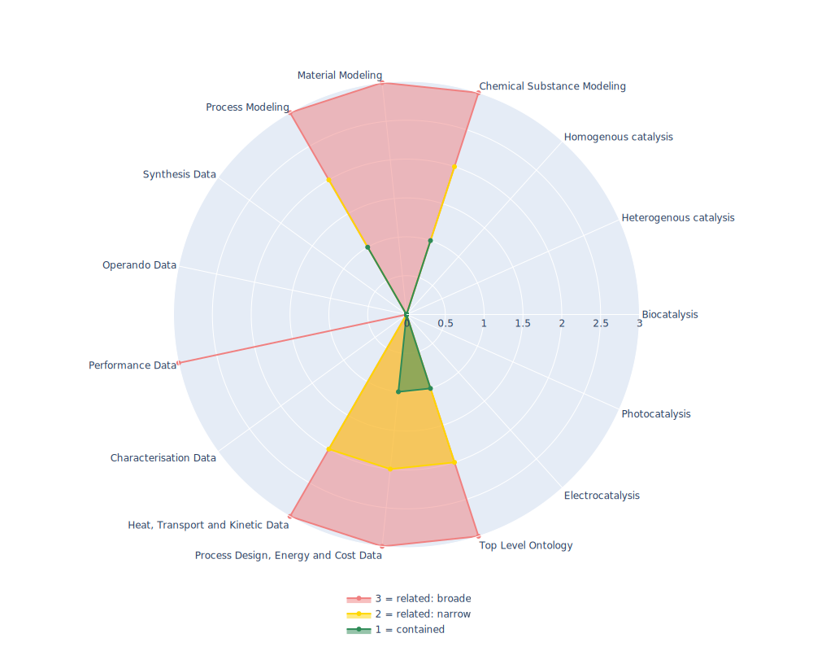

## OntoCAPE - Ontology for the domain of Computer Aided Process Engineering

 ## Radarplot 

 [HTML-Version](../radarplots/Radarplot_OntoCAPE.html)  
## Ontology

|Aspect |Description| 
 |:---|:---|
| Full Name | Ontology for the domain of Computer Aided Process Engineering |
| Synonyms/Alternative Names | ontology for the domain of Computer Aided Process Engineering |
| Ontology Acronym | OntoCAPE |
| Creator(s) & Issuing Organisation | RWTH Aachen University |
| Nature of Organisational Structure | University |

## References

|Aspect |Description| 
 |:---|:---|
| Organisational Website | https://www.avt.rwth-aachen.de/cms/AVT/Forschung/Sonstiges/Software/~ipts/OntoCape/?lidx=1 |
| Persistent URI of Ontology File | https://www.avt.rwth-aachen.de/global/show_document.asp?id=aaaaaaaaaatptsn |
| Link to Documentation | - |
| Link to Version directory | - |
| Optional links (Papers, Repos,...) | http://www.springer.com/chemistry/book/978-3-642-04654-4 |

## Ontology Modeling And Availability

|Aspect |Description| 
 |:---|:---|
| Ontology Formats Provided | owl |
| Degree of Inference/Composition | non-inferred; non-compacted |
| License | GNU General Public 3 |
| Validated Resoning with | RacerPro is supposed to work, but is an deprecated reasoner |
| Shortest reasoning time | - |
| Aligned with Top Level Ontology | No, includes own TLO |
| Imports Ontology(ies) | - |
| Prefixes used | dcterms; rdfs |
| Class annotation types | label via class IRI; definition via rdfs:comment |

## Domain of Interest Represented (contained, related: broader/narrower, missing)

|Aspect |Description| 
 |:---|:---|
| Top Level Ontology | contained |
| Process Design, Energy and Cost Data | contained |
| Heat, Transport and Kinetic Data | related: narrower |
| Characterisation Data | missing |
| Performance Data | related: broader |
| Operando Data | missing |
| Synthesis Data | missing |
| Process Modeling | contained |
| Material Modeling | related: broader |
| Chemical Substance Modeling | contained |
| Photocatalysis | missing |
| Electrocatalysis | missing |
| Heterogenous catalysis | missing |
| Homogenous catalysis | missing |
| Biocatalysis | missing |

## Ontology Characteristics

|Aspect |Description| 
 |:---|:---|
| Axioms | 5019 |
| Logical | 3067 |
| Declaration | 1048 |
| Class count | 503 |
| Object property count | 207 |
| Data property count | 37 |
| Individual count | 300 |
| Annotation Property count | 4 |

## Comments

Looks like not maintained anymore since 2009. Modular setup of subontologies in separate files and linkage to ontology files via C:/OntoCAPE/ as base instead of an actual URI makes it difficult to reason and to reuse.
While it contains good ideas on process modeling (special focus on ASPEN), it does not fit to current standards (Top Level, IRIs pointing to local files, mutliple ontology module files instead of one large file containing the whole ontology...)
Additionally, reasoning gets very complicated because of the modular setup of the sub-ontologies. [AB] was not yet able to run a reasoner (tried Fact++ and HermiT) without error. Even reasoning just the heat exchanger module produced non resolvable reasoning errors.
