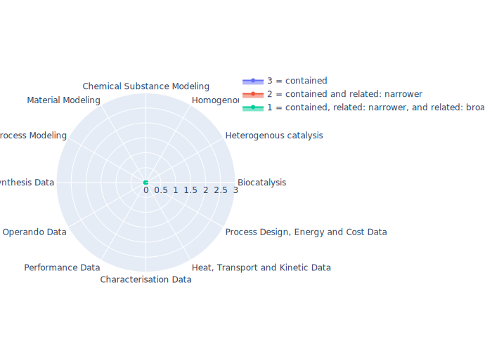

## PIMS-II - Physicalistic Interpretation of Modelling and Simulation - Interoperability Infrastructure

  

## Ontology
|Aspect |Description| 
 |:---|:---|
| Full Name | Physicalistic Interpretation of Modelling and Simulation - Interoperability Infrastructure |
| Synonyms/Alternative Names | - |
| Ontology Acronym | PIMS-II |
| Creator(s) & Issuing Organisation | Martin Thomas Horsch (ORCID 0000-0002-9464-6739) published by Innovation Centre for Process Data Technology (Inprodat e.V.) |
| Nature of Organisational Structure | Single Maintainer |

## References
|Aspect |Description| 
 |:---|:---|
| Organisational Website | http://www.molmod.info/semantics/pims-ii/ |
| Persistent URI of Ontology File | http://www.molmod.info/semantics/pims-ii.ttl |
| Link to Documentation | - |
| Link to Version directory | - |
| Optional links (Papers, Repos,...) | http://ceur-ws.org/Vol-2969/paper3-FOUST.pdf; http://ceur-ws.org/Vol-3249/paper2-CAOS.pdf |

## Ontology Modeling And Availability
|Aspect |Description| 
 |:---|:---|
| Ontology Formats Provided | ttl |
| Degree of Inference/Composition | non-inferred; non-compacted |
| License | GNU LGPL v3.0 |
| Validated Resoning with | Fact++ |
| Shortest reasoning time | 1910 ms |
| Aligned with Top Level Ontology | None |
| Imports Ontology(ies) | None |
| Prefixes used | - |
| Class annotation types | rdfs:Label; rdfs:comment |

## Domain of Interest Represented (contained, related: broader/narrower, missing)
|Aspect |Description| 
 |:---|:---|
| Biocatalysis | missing |
| Heterogenous catalysis | missing |
| Homogenous catalysis | missing |
| Chemical Substance Modeling | missing |
| Material Modeling | missing |
| Process Modeling | missing |
| Synthesis Data | missing |
| Operando Data | missing |
| Performance Data | missing |
| Characterisation Data | missing |
| Heat, Transport and Kinetic Data | missing |
| Process Design, Energy and Cost Data | missing |
| Top Level Ontology | missing |

## Ontology Characteristics
|Aspect |Description| 
 |:---|:---|
| Axioms | 2588 |
| Logical | 1201 |
| Declaration | 417 |
| Class count | 135 |
| Object property count | 284 |
| Data property count | 1 |
| Individual count | 0 |
| Annotation Property count | 17 |

## Comments
An Ontology for depicting Knowledge Claims
