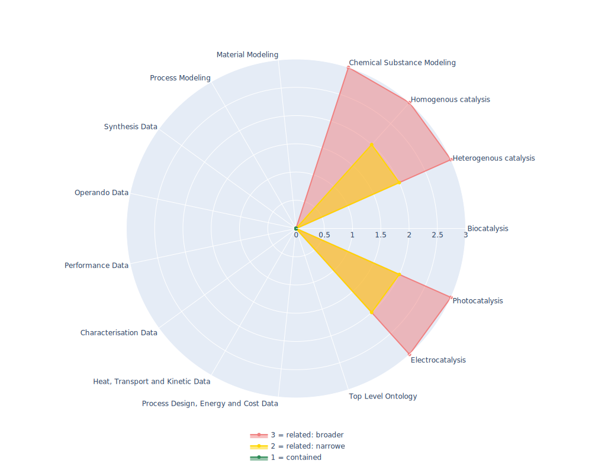

## REX - Physico-chemical process

 ## Radarplot 

 [HTML-Version](../radarplots/Radarplot_REX.html)  
## Ontology

|Aspect |Description| 
 |:---|:---|
| Full Name | Physico-chemical process |
| Synonyms/Alternative Names | - |
| Ontology Acronym | REX |
| Creator(s) & Issuing Organisation | - |
| Nature of Organisational Structure | - |

## References

|Aspect |Description| 
 |:---|:---|
| Organisational Website | - |
| Persistent URI of Ontology File | http://ontologies.berkeleybop.org/rex.owl |
| Link to Documentation | - |
| Link to Version directory | https://ontobee.org/ontology/REX |
| Optional links (Papers, Repos,...) | - |

## Ontology Modeling And Availability

|Aspect |Description| 
 |:---|:---|
| Ontology Formats Provided | owl |
| Degree of Inference/Composition | non inferred |
| License | - |
| Validated Resoning with | HermiT, FaCT++ |
| Shortest reasoning time | 33ms |
| Aligned with Top Level Ontology | OBO 1.0 (deprecated) |
| Imports Ontology(ies) | - |
| Prefixes used | obo |
| Class annotation types | rdfs:label, definition : OBO/IAO_0000115 |

## Domain of Interest Represented (contained, related: broader/narrower, missing)

|Aspect |Description| 
 |:---|:---|
| Top Level Ontology | missing |
| Process Design, Energy and Cost Data | missing |
| Heat, Transport and Kinetic Data | missing |
| Characterisation Data | missing |
| Performance Data | missing |
| Operando Data | missing |
| Synthesis Data | missing |
| Process Modeling | missing |
| Material Modeling | missing |
| Chemical Substance Modeling | related: broader |
| Photocatalysis | related:narrower |
| Electrocatalysis | related: narrower |
| Heterogenous catalysis | related: narrower |
| Homogenous catalysis | related: narrower |
| Biocatalysis | missing |

## Ontology Characteristics

|Aspect |Description| 
 |:---|:---|
| Axioms | 3609 |
| Logical | 730 |
| Declaration | 569 |
| Class count | 552 |
| Object property count | 6 |
| Data property count | 0 |
| Individual count | 0 |
| Annotation Property count | 12 |

## Comments

Orphaned ontology! Contains plenty of reaction classes, also catalytic ones. Only classifies broadly and does not contain many relations.
However, some catalysis classifications are contained.
