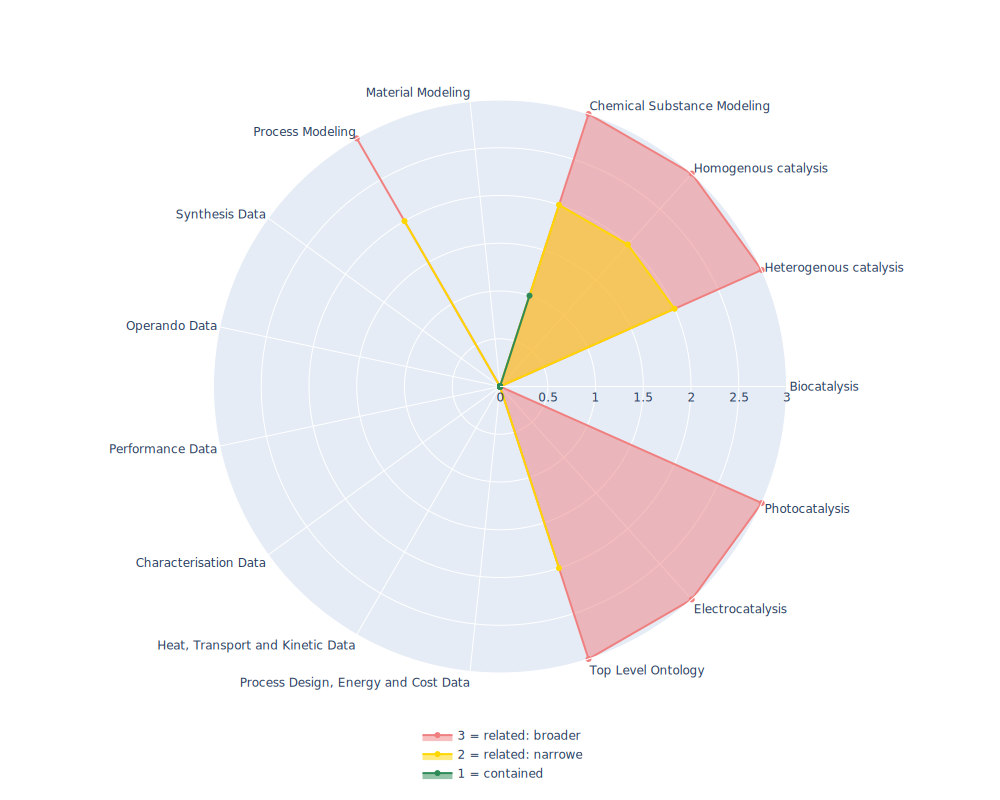

## RXNO - RXNO: name reaction ontology

 ## Radarplot 

 [HTML-Version](../radarplots/Radarplot_RXNO.html)  
## Ontology

|Aspect |Description| 
 |:---|:---|
| Full Name | RXNO: name reaction ontology |
| Synonyms/Alternative Names | - |
| Ontology Acronym | RXNO |
| Creator(s) & Issuing Organisation | Colin Batchelor et al. , Royal Society of Chemistry (RSC) |
| Nature of Organisational Structure | Multiple maintainers |

## References

|Aspect |Description| 
 |:---|:---|
| Organisational Website | https://github.com/rsc-ontologies/rxno |
| Persistent URI of Ontology File | https://raw.githubusercontent.com/rsc-ontologies/rxno/master/rxno.owl |
| Link to Documentation | https://github.com/rsc-ontologies/rxno/tree/master/docs |
| Link to Version directory | https://github.com/rsc-ontologies/rxno |
| Optional links (Papers, Repos,...) | https://en.wikipedia.org/wiki/RXNO_Ontology |

## Ontology Modeling And Availability

|Aspect |Description| 
 |:---|:---|
| Ontology Formats Provided | owl, obo |
| Degree of Inference/Composition | non inferred |
| License | CC-BY-4.0 |
| Validated Resoning with | FaCT++, HermiT |
| Shortest reasoning time | 182 ms |
| Aligned with Top Level Ontology | some OBO and BFO but not complete TLO contained in ontology |
| Imports Ontology(ies) | - |
| Prefixes used | chebi,dc,obo,oboInOwl,owl,rdf,rdfs,terms,xml,xsd |
| Class annotation types | rdfs:label, OBO:IAO_0000115 for textual definitions |

## Domain of Interest Represented (contained, related: broader/narrower, missing)

|Aspect |Description| 
 |:---|:---|
| Top Level Ontology | related: narrower |
| Process Design, Energy and Cost Data | missing |
| Heat, Transport and Kinetic Data | missing |
| Characterisation Data | missing |
| Performance Data | missing |
| Operando Data | missing |
| Synthesis Data | missing |
| Process Modeling | related: narrower |
| Material Modeling | missing |
| Chemical Substance Modeling | contained |
| Photocatalysis | related: broader |
| Electrocatalysis | related: broader |
| Heterogenous catalysis | related: narrower |
| Homogenous catalysis | related: narrower |
| Biocatalysis | missing |

## Ontology Characteristics

|Aspect |Description| 
 |:---|:---|
| Axioms | 8342 |
| Logical | 1730 |
| Declaration | 1068 |
| Class count | 1019 |
| Object property count | 14 |
| Data property count | 0 |
| Individual count | 0 |
| Annotation Property count | 35 |

## Comments

Good conceptual description of reactions. Strongly connected with the MOP. It contains more than 500 classes representing organic reactions such as the Diels–Alder cyclization. The documentation also contains a good overview on how to reuse the classes contained in this ontology.
