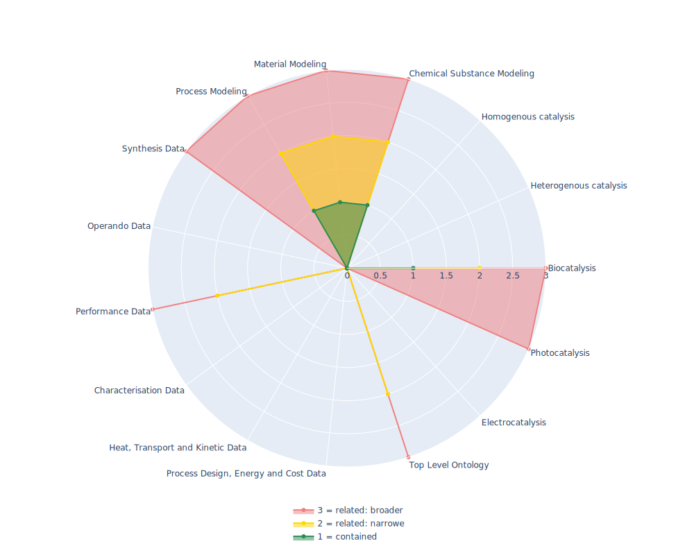

## SBO - Systems Biology Ontology

 ## Radarplot 

 [HTML-Version](../radarplots/Radarplot_SBO.html)  
## Ontology

|Aspect |Description| 
 |:---|:---|
| Full Name | Systems Biology Ontology |
| Synonyms/Alternative Names | - |
| Ontology Acronym | SBO |
| Creator(s) & Issuing Organisation | Tung Nguyen, Jonathan Karr, Rahuman Sheriff |
| Nature of Organisational Structure | Maintained by community via GitHub |

## References

|Aspect |Description| 
 |:---|:---|
| Organisational Website | https://www.ebi.ac.uk/ols/ontologies/sbo |
| Persistent URI of Ontology File | https://raw.githubusercontent.com/EBI-BioModels/SBO/master/SBO_OWL.owl |
| Link to Documentation | - |
| Link to Version directory | https://github.com/EBI-BioModels/SBO/blob/master/SBO_OWL.owl |
| Optional links (Papers, Repos,...) | https://github.com/EBI-BioModels/SBO/ |

## Ontology Modeling And Availability

|Aspect |Description| 
 |:---|:---|
| Ontology Formats Provided | owl, obo |
| Degree of Inference/Composition | non inferred |
| License | Artistic-2.0 license  |
| Validated Resoning with | HermiT, FaCT++ |
| Shortest reasoning time | 11 ms |
| Aligned with Top Level Ontology | OBO |
| Imports Ontology(ies) | - |
| Prefixes used | daml; mathml |
| Class annotation types | rdfs:label, rdfs:comment |

## Domain of Interest Represented (contained, related: broader/narrower, missing)

|Aspect |Description| 
 |:---|:---|
| Top Level Ontology | related: narrower |
| Process Design, Energy and Cost Data | missing |
| Heat, Transport and Kinetic Data | missing |
| Characterisation Data | missing |
| Performance Data | related:narrower |
| Operando Data | missing |
| Synthesis Data | related: broader |
| Process Modeling | contained: broader |
| Material Modeling | contained: broader |
| Chemical Substance Modeling | contained: narrower |
| Photocatalysis | related:broader |
| Electrocatalysis | missing |
| Heterogenous catalysis | missing |
| Homogenous catalysis | missing |
| Biocatalysis | contained |

## Ontology Characteristics

|Aspect |Description| 
 |:---|:---|
| Axioms | 2982 |
| Logical | 745 |
| Declaration | 695 |
| Class count | 694 |
| Object property count | 1 |
| Data property count | 0 |
| Individual count | 0 |
| Annotation Property count | 4 |

## Comments

Controlled vocabulary for Systems Biology and computational modeling in Systems Biology.
