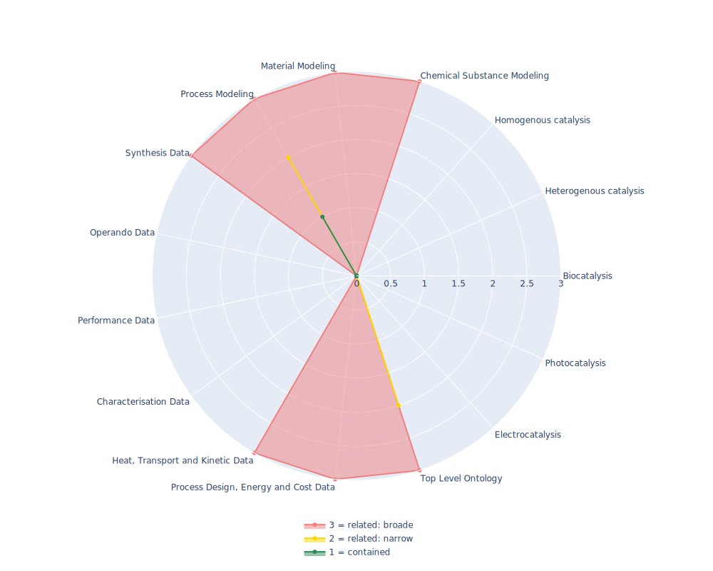

## VIMMP - Virtual Materials Marketplace Ontology

 ## Radarplot 

 [HTML-Version](../radarplots/Radarplot_VIMMP.html)  
## Ontology

|Aspect |Description| 
 |:---|:---|
| Full Name | Virtual Materials Marketplace Ontology |
| Synonyms/Alternative Names | - |
| Ontology Acronym | VIMMP |
| Creator(s) & Issuing Organisation | doi:10.1007/s13218-020-00648-9; doi:10.1021/acs.jced.9b00739; doi:10.5281/zenodo.3936795; Virtual Materials Marketplace (VIMMP) project consortium;Adham Hashibon; Andrea Scotto di Minico; Andreas Fiseni; Barbara Andreon; Barbora Planková (ORCID 0000-0002-3309-6809); Björn Schembera (ORCID 0000-0003-2860-6621); Christoph Niethammer; Daniele Toti (ORCID 0000-0002-9668-6961); Emanuele Ghedini (ORCID 0000-0003-3805-8761); Esteban Bayro Kaiser (ORCID 0000-0002-5281-0836); Georg J. Schmitz (0000-0003-4065-9742); Gerhard Goldbeck (ORCID 0000-0002-4181-2852); Gianluca Boccardo (ORCID 0000-0003-1264-8237); Hauke Brüning; Helge Krieg; Ignacio Pagonabarraga Mora (ORCID 0000-0002-6187-5025); Jadran Vrabec (ORCID 0000-0002-7947-4051); Javier Díaz Brañas; Jean-Pierre Minier; Joshua D. Elliott (ORCID 0000-0002-0729-246X); Karel Šindelka (ORCID 0000-0003-3925-924X); Mara Chiricotto (ORCID 0000-0003-1609-5254); Martin Lísal (ORCID 0000-0001-8005-7143); Natalia A. Konchakova; Paola Carbone (ORCID 0000-0001-9927-8376); Pascale Noyret; Peter Klein; Peter Schiffels; Philipp Neumann; Vincent Stobiac; Vladimir Lobaskin (ORCID 0000-0002-5231-0639); Welchy Leite Cavalcanti; Youness Bami; Yvan Fournier; Éric Fayolle; Ilian T. Todorov (ORCID 0000-0001-7275-1784); Martin Thomas Horsch (ORCID 0000-0002-9464-6739); Michael A. Seaton (ORCID 0000-0002-4708-573X); Silvia Chiacchiera (ORCID 0000-0003-0422-7870) |
| Nature of Organisational Structure | terminated consortium of the EMMC |

## References

|Aspect |Description| 
 |:---|:---|
| Organisational Website | https://www.vimmp.eu/ |
| Persistent URI of Ontology File | https://gitlab.com/vimmp-semantics/vimmp-ontologies/-/raw/master/combined/combined-vimmp-ontologies.ttl |
| Link to Documentation | https://zenodo.org/record/4411422 |
| Link to Version directory | https://gitlab.com/vimmp-semantics/vimmp-ontologies |
| Optional links (Papers, Repos,...) | https://zenodo.org/record/4411422 |

## Ontology Modeling And Availability

|Aspect |Description| 
 |:---|:---|
| Ontology Formats Provided | ttl |
| Degree of Inference/Composition | combined and inferred |
| License | GNU Lesser General Public License (LGPL) version 3 |
| Validated Resoning with | Inconsistencies in HermiT and FacT++ in at least a depth 3 inconsistencie "layers" (meaning major totally separeted logic areas) |
| Shortest reasoning time | - |
| Aligned with Top Level Ontology | EMMO 1-0-0.beta1 |
| Imports Ontology(ies) | all vimmp ontologies and most EMMO subset ontologies |
| Prefixes used | dcterms; skos |
| Class annotation types | rdfs:label, qudt:description, skos:prefLabel as Dataproperty? |

## Domain of Interest Represented (contained, related: broader/narrower, missing)

|Aspect |Description| 
 |:---|:---|
| Top Level Ontology | related: narrower |
| Process Design, Energy and Cost Data | related: broader |
| Heat, Transport and Kinetic Data | related: broader |
| Characterisation Data | missing |
| Performance Data | missing |
| Operando Data | missing |
| Synthesis Data | related: broader |
| Process Modeling | contained |
| Material Modeling | related: broader |
| Chemical Substance Modeling | related: broader |
| Photocatalysis | missing |
| Electrocatalysis | missing |
| Heterogenous catalysis | missing |
| Homogenous catalysis | missing |
| Biocatalysis | missing |

## Ontology Characteristics

|Aspect |Description| 
 |:---|:---|
| Axioms | 10812 |
| Logical | 7252 |
| Declaration | 1712 |
| Class count | 1082 |
| Object property count | 580 |
| Data property count | 191 |
| Individual count | 897 |
| Annotation Property count | 19 |

## Comments

Ontology with is developed to combine several marketplaces, such as Material handling/transport/aso as well as simulations/compotations/aso. As it is not well defined/annotated and lacks a good documentation for how to add data, it is quiet complicated to make use of it outside of the propriatarilly developed tools. Reasonning erorrs and the termination of further development/alignment to the EMMO make it nearly unuseable accept as a organ donor. As such the Ontology has a lot of good concepts and is well developed.
