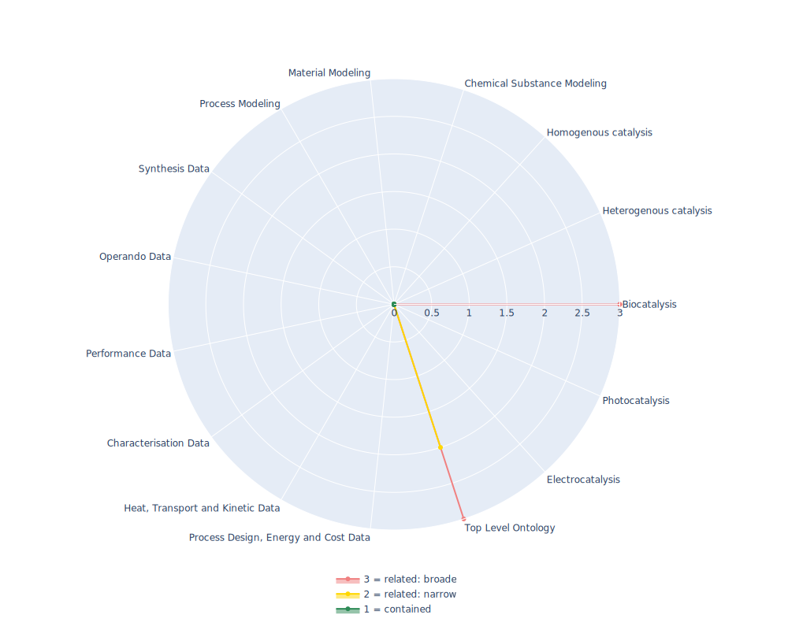

## eNanoMapper - OBO Relations Ontology

 ## Radarplot 

 [HTML-Version](../radarplots/Radarplot_eNanoMapper.html)  
## Ontology

|Aspect |Description| 
 |:---|:---|
| Full Name | OBO Relations Ontology |
| Synonyms/Alternative Names | - |
| Ontology Acronym | eNanoMapper |
| Creator(s) & Issuing Organisation | OBO Foundry |
| Nature of Organisational Structure | Consortium, Ontology is still actively maintained |

## References

|Aspect |Description| 
 |:---|:---|
| Organisational Website | https://oborel.github.io/ |
| Persistent URI of Ontology File | http://purl.obolibrary.org/obo/ro.owl |
| Link to Documentation | https://oborel.github.io/obo-relations/ |
| Link to Version directory | http://obofoundry.org/ontology/ro |
| Optional links (Papers, Repos,...) | https://github.com/oborel/obo-relations |

## Ontology Modeling And Availability

|Aspect |Description| 
 |:---|:---|
| Ontology Formats Provided | owl, obo |
| Degree of Inference/Composition | non inferred |
| License | CC0 1.0 |
| Validated Resoning with | HermiT |
| Shortest reasoning time | - |
| Aligned with Top Level Ontology | OBO |
| Imports Ontology(ies) | - |
| Prefixes used | cito,core,dc,doap,foaf,obo,oboInOwl,owl,rdf,rdfs,skos,subsets,swrl,swrla,swrlb,terms,xml,xsd |
| Class annotation types | rdfs:label, OBO:IAO_0000115 for textual definitions |

## Domain of Interest Represented (contained, related: broader/narrower, missing)

|Aspect |Description| 
 |:---|:---|
| Top Level Ontology | related: narrower |
| Process Design, Energy and Cost Data | missing |
| Heat, Transport and Kinetic Data | missing |
| Characterisation Data | missing |
| Performance Data | missing |
| Operando Data | missing |
| Synthesis Data | missing |
| Process Modeling | missing |
| Material Modeling | missing |
| Chemical Substance Modeling | missing |
| Photocatalysis | missing |
| Electrocatalysis | missing |
| Heterogenous catalysis | missing |
| Homogenous catalysis | missing |
| Biocatalysis | related:broader |

## Ontology Characteristics

|Aspect |Description| 
 |:---|:---|
| Axioms | 7324 |
| Logical | 1540 |
| Declaration | 899 |
| Class count | 58 |
| Object property count | 673 |
| Data property count | 1 |
| Individual count | 35 |
| Annotation Property count | 137 |

## Comments

