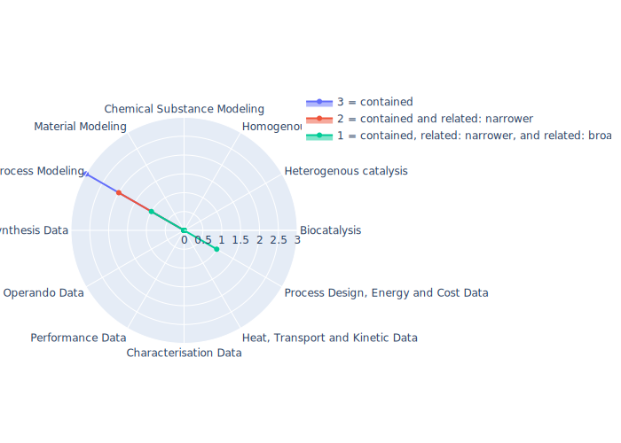

## metadata4ing - Metadata4Ing: An ontology for describing the generation of research data within a scientific activity.

 ## Radarplot 

 [HTML-Version](../radarplots/Radarplot_metadata4ing.html)  
## Ontology

|Aspect |Description| 
 |:---|:---|
| Full Name | Metadata4Ing: An ontology for describing the generation of research data within a scientific activity. |
| Synonyms/Alternative Names | - |
| Ontology Acronym | metadata4ing |
| Creator(s) & Issuing Organisation | Metadata4Ing Workgroup: Ashish Karmacharya, Benjamin Farnbacher, Cord Wiljes, Dorothea Iglezakis, Džulia Terzijska, Giacomo Lanza, Johanna Hickmann, Johannes Theissen-Lipp, Johannes Munke, Jürgen Windeck, Marc Fuhrmans, Martin Thomas Horsch, Nils Hoppe, Sophia Leimer, Stephan Hachinger, Susanne Arndt,  |
| Nature of Organisational Structure | NFDI4ng, Ontology is still actively maintained |

## References

|Aspect |Description| 
 |:---|:---|
| Organisational Website | https://nfdi4ing.de/special-interest-groups-sig/metadata-ontologies/ |
| Persistent URI of Ontology File | https://git.rwth-aachen.de/nfdi4ing/metadata4ing/metadata4ing/-/raw/develop/metadata4ing.ttl |
| Link to Documentation | https://nfdi4ing.pages.rwth-aachen.de/metadata4ing/metadata4ing/index.html |
| Link to Version directory | https://git.rwth-aachen.de/nfdi4ing/metadata4ing/metadata4ing/ |
| Optional links (Papers, Repos,...) | https://zenodo.org/record/5957104 ; https://tuprints.ulb.tu-darmstadt.de/20946/1/Vortrag%20NFDI4Ing%20%282%29.pdf |

## Ontology Modeling And Availability

|Aspect |Description| 
 |:---|:---|
| Ontology Formats Provided | ttl, rdf/xml, json-LD, nt |
| Degree of Inference/Composition | non inferred |
| License | CC-BY-4.0 |
| Validated Resoning with | HermiT |
| Shortest reasoning time | 207 ms |
| Aligned with Top Level Ontology | - |
| Imports Ontology(ies) | - |
| Prefixes used | bibo,biro,dcat,dcterms,emmo,foaf,m4i,obo,owl,pims-ii,prov,qudt,rdf,rdfs,schema,si,skos,ssn,vann,xml,xsd |
| Class annotation types | skos:prefLabel, rdfs:comment |

## Domain of Interest Represented (contained, related: broader/narrower, missing)

|Aspect |Description| 
 |:---|:---|
| Top Level Ontology | missing |
| Process Design, Energy and Cost Data | related: broader |
| Heat, Transport and Kinetic Data | missing |
| Characterisation Data | missing |
| Performance Data | missing |
| Operando Data | missing |
| Synthesis Data | missing |
| Process Modeling | contained |
| Material Modeling | missing |
| Chemical Substance Modeling | missing |
| Photocatalysis | missing |
| Electrocatalysis | missing |
| Heterogenous catalysis | missing |
| Homogenous catalysis | missing |
| Biocatalysis | missing |

## Ontology Characteristics

|Aspect |Description| 
 |:---|:---|
| Axioms | 1086 |
| Logical | 245 |
| Declaration | 173 |
| Class count | 32 |
| Object property count | 56 |
| Data property count | 32 |
| Individual count | 21 |
| Annotation Property count | 35 |

## Comments

Aiming for the definition of processes, Metadata4Ing defines classes and properties or reuses such classes and properties from other ontologies to describe research processes and research data management in NFDI4Ing. 
